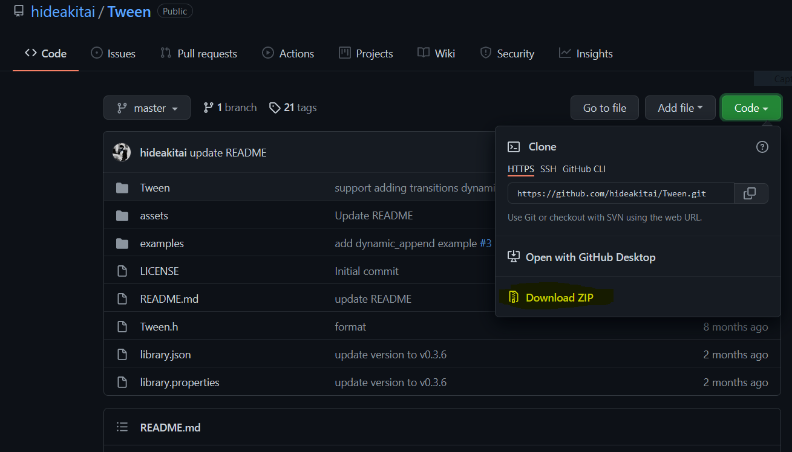
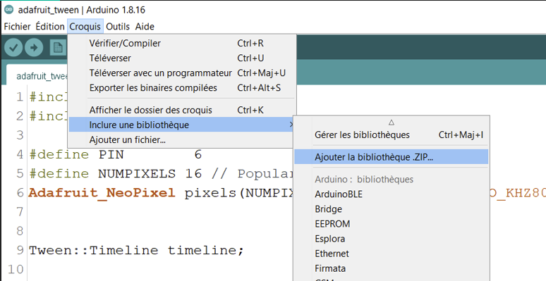

<!-- vscode-markdown-toc -->
# <a name='Contenu'></a>Contenu
 1. [Brancher un anneau ou ruban de Leds](#BrancherunanneauourubandeLeds)
	* 1.1. [Installation de la bibliothèque](#Installationdelabibliothque)
	* 1.2. [Programmer les leds manuellement](#Programmerlesledsmanuellement)
	* 1.3. [Utiliser une boucle pour assigner toutes les leds](#Utiliserunebouclepourassignertouteslesleds)
	* 1.4. [Le mode de couleur HSB](#LemodedecouleurHSB)
 2. [La bibliothèque Tween](#LabibliothqueTween)
	* 2.1. [Timeline](#Timeline)
	* 2.2. [Transition simple](#Transitionsimple)
	* 2.3. [Contrôler deux valeurs avec la timeline](#Contrlerdeuxvaleursaveclatimeline)
	* 2.4. [Les transitions en mode RGB](#LestransitionsenmodeRGB)
 3. [Programmation avancée](#Programmationavance)
	* 3.1. [Animation radiale](#Animationradiale)
	* 3.2. [Noise](#Noise)
	* 3.3. [Mélanger timeline et animations](#Mlangertimelineetanimations)
 4. [Brancher et assigner plusieurs anneaux](#Brancheretassignerplusieursanneaux)
	* 4.1. [Deux anneaux - alimentation par arduino](#Deuxanneauxalimentationpararduino)
	* 4.2. [Trois anneaux - alimentation externe](#Troisanneauxalimentationexterne)

<!-- vscode-markdown-toc-config
	numbering=true
	autoSave=true
	/vscode-markdown-toc-config -->
<!-- /vscode-markdown-toc -->

A crash course focused on led animation with arduino for designers

Dans ce document nous allons nous concentrer sur la création d'animations basées sur une timeline qui se joueront sur des leds de type neopixels; 

Cette ressource n'a pas vocation à être une introduction à arduino, vous pourrez trouver une ressource plus générale sur arduino et suivant ce lien : https://github.com/b2renger/Introduction_Arduino

Il peut-être intéressant de lire l'introduction du lien ci-dessus si vous ne connaissez absolument pas arduino avant de continuer; notament si vous souhaitez découvrir l'anatomie d'une carte arduino, les principes de base des broches d'entrée et sortie, ainsi que le logiciel permettant de programmer les cartes.


##  1. <a name='BrancherunanneauourubandeLeds'></a>Brancher un anneau ou ruban de Leds

Il faut comprendre qu'un anneau de leds consomme du courant et qu'une carte arduino ne peut fournir qu'une certaine quantité de courant, et donc à partir d'un certain nombre il faudra avoir recours à une alimentation externe. Mais nous détaillerons ça plus tard.

Commençons donc par brancher notre premier anneau, directement sur la carte :


Nous pouvons maintenant ouvrir le logiciel [arduino](https://www.arduino.cc/en/software), afin de programmer !

[**^ Home**](#Contenu)

###  1.1. <a name='Installationdelabibliothque'></a>Installation de la bibliothèque

Afin de pouvoir adresser des couleurs aux leds il faut utiliser une bibliothèque logicielle dédiée au type de leds utiliser.

Il faut donc l'installer via **le gestionnaire de bibliothèques**, accessible depuis le menu *Croquis* -> *Inclure une bibliothèque* -> *Gérer les bibliothèques*.


Puis, dans le champ de recherche taper "neopixels" et choisir la bibliothèque *Adafruit NeoPixel*


[**^ Home**](#Contenu)

###  1.2. <a name='Programmerlesledsmanuellement'></a>Programmer les leds manuellement

Pour commencer à produire de la lumière le plus simple est d'adresser les leds manuellement en utilisant l'index de la led que nous voulons éclairer. L'index étant un chiffre correspondant au numéro de la led sur l'anneau.


```c
// inclure la bibliothèque nécessaire
#include <Adafruit_NeoPixel.h>

// initialiser l'anneau de leds avec 16 leds connectés sur la pin 6
#define NUMPIXELS 16

Adafruit_NeoPixel ring1 = Adafruit_NeoPixel(NUMPIXELS, 6, NEO_GRB + NEO_KHZ800); 
// notre anneau est maintenant représenté par l'alias "ring1"

void setup() {
  // intialiser l'anneau  
  ring1.begin(); 
}

void loop() {
    // donner une couleur à certains pixels en RGB (max = 255)
    // 0 -> rouge
    ring1.setPixelColor(0, ring1.Color(255, 0, 0)); 

    // 1 -> vert
    ring1.setPixelColor(1, ring1.Color(0, 255, 0)); 
    // 2 -> bleu
    ring1.setPixelColor(2, ring1.Color(0, 0, 255));
    // 3 -> blanc
    ring1.setPixelColor(3, ring1.Color(255, 255, 255)); 
    // 4 -> noir
    ring1.setPixelColor(4, ring1.Color(0, 0, 0)); // noir
    // 5 -> jaune
    ring1.setPixelColor(5, ring1.Color(255, 255, 0));
    // 6 -> rose
    ring1.setPixelColor(6, ring1.Color(255, 0, 255));
    // 7 -> turquoise
    ring1.setPixelColor(6, ring1.Color(0, 255, 255));
    // on actualise le ruban de led 
    ring1.show(); 
}
```

Vous devriez alors obtenir ce résultat :


Rien que pour 16 leds ce processus est un peu fastidieu; imaginez alors en avoir 32 ou 400 ! et ne parlons même pas des animations potentielles que nous souhaiterions créer ... 

[**^ Home**](#Contenu)

###  1.3. <a name='Utiliserunebouclepourassignertouteslesleds'></a>Utiliser une boucle pour assigner toutes les leds

En programmation nous pouvons utiliser une **boucle for** pour répéter une action plusieures fois.

Une boucle for s'écrit comme cela :

```c
for ( /* conditions à remplir */ ){
  /*
  code à éxécuter tant que les conditions sont vérifiées
  */
}
```

il est donc important de bien identifier les parenthèses - qui servent à délimiter les conditions d'éxécution du code, qui lui est entre accolades.

D'un point de vue pratique, les conditions vont être exprimée en 3 étapes :

- on va créer une variable (ici un nombre entier) et on va lui donner une valeur de démarrage :
  ```
  int cpt = 0;
  ```
  => notre variable s'appelle 'cpt' (pour compteur), et elle vaut zéro au début.

- on exprime ensuite la condition d'arrêt :
  ```
  cpt < 30;
  ```
  => si jamais i dépasse 29 on s'arrête et on sort de la boucle for; on continuera alors l'éxécution du programme de manière séquentielle (ligne par ligne).

- finalement on définit la manière dont notre compteur évolue après chaque éxécution du code entre accolades, par exemple :
  ```
  cpt = cpt + 5;
  ```
  => à chaque fois que le code est éxécuté on augmente notre variable cpt de 5.

Du coup, en écrivant : 
  ```c
  for (int cpt = 0 ; cpt < 30 ; cpt = cpt +5){

  }
  ```
Le code entre les accolades, sera éxécuté :
  - un première fois avec cpt valant 0
  - une deuxième fois avec cpt valant 5
  - etc
  - un cinquième fois avec cpt valant 25

A la sixième fois *cpt* vaudra 30 et ne sera donc plus strictement inférieur à 30. On sortira alors de la boucle pour éxécuter le code directement en dessous.

Si nous appliquons cela à nos leds, cela donne :

```c
// inclure la bibliothèque nécessaire
#include <Adafruit_NeoPixel.h>

// initialiser l'anneau de leds avec 16 leds connectés sur la pin 6
#define NUMPIXELS 16

Adafruit_NeoPixel ring1 = Adafruit_NeoPixel(NUMPIXELS, 6, NEO_GRB + NEO_KHZ800);
// notre anneau est maintenant représenté par l'alias "ring1"

void setup() {
  // intialiser l'anneau
  ring1.begin();
}

void loop() {
  // on répéte une ligne de code pour chaque led
  // c'est à dire de la led à l'index 0 jusqu'à la led 15.
  for (int i = 0 ; i < NUMPIXELS ; i ++) {
    // pour la led à l'index i, on lui applique la couleur rouge
    ring1.setPixelColor(i, ring1.Color(255, 0, 0));
  }
  ring1.show();
}

```
Traditionellement, on utilise *i* car c'est plus court à écrire que *cpt*, mais on peut utiliser n'importe quel lettre ou mot.


Du coup on peut utiliser la valeur de notre compteur pour créer des dégradés. On peut utiliser la valeur que prend *i* à chaque répétition (dans notre cas elle augmente de 1), pour calculer d'autres nombres que l'on pourra utiliser pour nos composantes rgb.

```c
// inclure la bibliothèque nécessaire
#include <Adafruit_NeoPixel.h>

// initialiser l'anneau de leds avec 16 leds connectés sur la pin 6
#define NUMPIXELS 16

Adafruit_NeoPixel ring1 = Adafruit_NeoPixel(NUMPIXELS, 6, NEO_GRB + NEO_KHZ800);
// notre anneau est maintenant représenté par l'alias "ring1"

void setup() {
  // intialiser l'anneau
  ring1.begin();
}

void loop() {
  // on répéte une ligne de code pour chaque led
  // c'est à dire de la led à l'index 0 jusqu'à la led 15.
  for (int i = 0 ; i < NUMPIXELS ; i ++) {
    // pour la led à l'index i, on lui applique une couleur
    // dominante bleue, mais dont la composante rouge augmente
    // au fur et à mesure jusqu'à 255 et dont la composante
    // bleue diminue jusqu'à 0
    // map permet de calculer pour i compris entre 0 et NUMPIXELS
    // une valeur a comprise entre 0 et 255.
    int a = map(i, 0, NUMPIXELS, 0, 255);
    int b = 255 - a;
    ring1.setPixelColor(i, ring1.Color(a, 0, b));
  }
  ring1.show();
}
```
Ici la fonction map permet de faire un calcul qui est une simple règle de proportionalité (ou règle de trois)

On range dans une variable appelée *a*, le résultat du calcul effectué par [*map*](https://www.arduino.cc/reference/en/language/functions/math/map/), puis on utilise cette variable pour la composante rouge de notre calcul.
On calcule aussi une variable appelée *b* qui sera le "miroir" de *a* par rapport à la valeur max de 255.


[**^ Home**](#Contenu)

###  1.4. <a name='LemodedecouleurHSB'></a>Le mode de couleur HSB

Le mode RGB a ses limites, il permet de faire beaucoup de choses, mais il existe un autre mode appelé HSB pour : Hue Saturation Brightness. Cela signifie qu'en lieu et place de spécifier les composantes rouges, vertes et bleues, nous pouvons définir des couleur grâce à leur teinte, leur saturation et leur luminosité.

- la teinte est traditionellement exprimée entre 0 et 360 dans les sélécteurs de couleurs que vous pourez trouver en ligne. Ici elle sera exprimée entre 0 et 65535 (soit 2 puissance 16 pour avoir une finisse de sélection 16 bit).
- la saturation qui représente en réalité l'intensité des couleurs est traditionellement exprimée entre 0 et 100 ici elle sera exprimée entre 0 et 255. Si la saturation est à 0 nous aurons du blanc et si elle est à 255 nous aurons des couleurs pleines - très saturées.
- la luminosité est aussi traditionnellement exprimée entre 0 et 100 et encore une fois elle sera ici exprimée entre 0 et 255. Si la luminosité est à 0 nous aurons des leds éteintes (noires), si elle est à 255 nous aurons des leds allumées au maximum de leur puissance.

Il est alors très facile de créer un dégradé de teinte en utilisant une boucles for :

```c
// inclure la bibliothèque nécessaire
#include <Adafruit_NeoPixel.h>

// initialiser l'anneau de leds avec 16 leds connectés sur la pin 6
#define NUMPIXELS 16

Adafruit_NeoPixel ring1 = Adafruit_NeoPixel(NUMPIXELS, 6, NEO_GRB + NEO_KHZ800);
// notre anneau est maintenant représenté par l'alias "ring1"

void setup() {
  // intialiser l'anneau
  ring1.begin();
}

void loop() {
  // on répéte une ligne de code pour chaque led
  // c'est à dire de la led à l'index 0 jusqu'à la led 15.
  for (int i = 0 ; i < NUMPIXELS ; i ++) {
    int teinte = map(i, 0, NUMPIXELS, 0, 65535);
    uint32_t rgbcolor = ring1.ColorHSV(teinte, 255,255);
    ring1.setPixelColor(i, rgbcolor);
  }
  ring1.show();
}
```


Il est aussi possible de faire un dégradé de saturation ou de luminosité. Mais attention obtenir un dégradé qui perceptuellement soit valable il faut utiliser une correction gamma (suivez [ce lien pour en savoir plus](https://learn.adafruit.com/led-tricks-gamma-correction)).

C'est souvent valable pour des dégradés dans les couleurs pastelles.


```c
// inclure la bibliothèque nécessaire
#include <Adafruit_NeoPixel.h>

#define NUMPIXELS 16

// initialiser l'anneau de leds avec 16 leds connectés sur la pin 6
Adafruit_NeoPixel ring1 = Adafruit_NeoPixel(NUMPIXELS, 6, NEO_GRB + NEO_KHZ800);
// notre anneau est maintenant représenté par l'alias "ring1"

void setup() {
  // intialiser l'anneau
  ring1.begin();
}

void loop() {
  // on répéte une ligne de code pour chaque led
  // c'est à dire de la led à l'index 0 jusqu'à la led 15.
  for (int i = 0 ; i < NUMPIXELS ; i ++) {
    int sat = map(i, 0, NUMPIXELS, 0, 255);
    //uint32_t rgbcolor = ring1.ColorHSV(0, sat,255); // sans correction
    uint32_t rgbcolor = ring1.gamma32(ring1.ColorHSV(0, sat, 255));// avec correction
    ring1.setPixelColor(i, rgbcolor);
  }
  ring1.show();
}
```
Sans correction :


Avec correction :


[**^ Home**](#Contenu)

##  2. <a name='LabibliothqueTween'></a>La bibliothèque Tween

Nous allons maintenant découvrir comment il est possible de construire des animations de leds et des scénario de couleurs.

Il va s'agir de pouvoir exprimer en code la possibilité de passer par exemple d'un bleu à un orange en un certain temps.

Il est possible de tout coder directement, mais pour nous faciliter le travail nous allons utiliser une bibliothèque nommée **Tween**.

Malheureusement elle n'est pas disponible dans le gestionaire de bibliothèque arduino; il faut donc l'installer manuellement. 

Pour cela il faut se rendre sur la page du projet : 
https://github.com/hideakitai/Tween

Puis télécharger le code en cliquant sur le bouton vert *code*, puis sur *download zip* :


Ensuite côté arduino, il suffit d'importer le fichier zip qui vient d'être téléchargé :


et c'est bon la bibliothèque devrait être installé dans l'environnement arduino. Vous pouvez supprimer le fichier zip téléchargé.


[**^ Home**](#Contenu)

###  2.1. <a name='Timeline'></a>Timeline

Grâce à cette bibliothèque nous allons pouvoir travailler sous la forme de timeline.

C'est à dire spécifier des composantes de couleurs (RGB ou HSB) et des durées; la bibliothèque s'occupera de réaliser les transitions.

Pour trouver des couleurs exprimées en rgb ou hsb vous pouvez vous rendre ici :
https://color.adobe.com/fr/create/color-wheel


[**^ Home**](#Contenu)

###  2.2. <a name='Transitionsimple'></a>Transition simple

Pour notre première animation nous allons fonctionner en mode HSB et nous allons transiter :
- d'un bleu h: 173, s: 255, b: 255
- vers un orange h:20, s:255, b: 255


Nous n'avons qu'une seule composante qui change : la teinte et celle-ci doit passer de 173 à 20.

Notre code dirigeant les leds restera à peu près à l'identique. Mais nous allons utiliser une **variable** qui va être modifié par une timeline.

Une variable est un emplacement mémoire qui permet de stocker une valeur auquel on va donner un nom pour accéder à la valeur il suffira alors d'utiliser le nom que l'on a choisit.

```c
#include <Tween.h>
#include <Adafruit_NeoPixel.h>

// initialisation des leds
#define PIN        6
#define NUMPIXELS 16
Adafruit_NeoPixel ring1(NUMPIXELS, PIN, NEO_GRB + NEO_KHZ800);

// initialisation de la timeline
Tween::Timeline timeline;
// initialisation d'une variable qui va être modifiée
float teinte = .0f;

void setup() {

  ring1.begin();

  timeline.mode(Tween::Mode::REPEAT_TL); // la timeline doit se répéter à l'infini
  timeline.add(teinte) // elle va agir sur notre variable "teinte"
  .init(173) // au début on veut une teinte de 173 - light blue
  .then(20, 2000) // on va aller jusqu'à une teinte orangée de 20 en 2 secondes
  //.then<Ease::ElasticInOut>(29, 2000)
  .hold(2000) // on attend 2 secondes
  .then(173, 2000) // on revient à 173 en 2 secondes encore
  //.then<Ease::Sine>(173, 2000)
  .hold(2000); // on attend de nouveau 2 secondes avant de boucler.

  timeline.start(); // on démarre la timeline
}

void loop() {

  timeline.update(); // on fait les calculs de la timeline

  // on parcourt les leds comme d'habitude
  for (int i = 0; i < NUMPIXELS ; i++) {
    // on calcule une variable h1 qui transforme notre valeur teinte 
    //(qui est drivée par la timeline), grace à la fonction map
    // on passe d'une valeur entre 0 et 360 à une valeur entre 0 et 65535
    int h1 = map(teinte, 0, 360, 0, 65535);
    // on applique notre teinte à chaque pixel de notre anneau
    // en gardant la saturation et la luminosité au maxium
    ring1.setPixelColor(i, ring1.gamma32(ring1.ColorHSV (h1, 255, 255)));

  }
  
  ring1.show(); // on n'oublie pas d'afficher les couleurs sur l'anneau
}
```

Ici nous avons réalisé des transitions linéaires, mais il est possible d'utiliser des courbes de **easing** qui permettent de gérer des accélération et ralentissements.

Vous pouvez vous référer à cette page pour comprendre comment fonctionnent les différentes fonctions de easing : https://easings.net/


et à cette page pour avoir la syntaxe des différents types disponibles dans la bibliothèque :
https://github.com/hideakitai/Tween#easing-types

Vous pouvez essayer de remplacer la ligne :
```c
.then(20, 2000) // on va aller jusqu'à une teinte orangée de 20 en 2 secondes
```

par :
```c
.then<Ease::ElasticInOut>(29, 2000)
```
qui réalisera un easing elastique en entrée et en sortie d'animation.


[**^ Home**](#Contenu)

###  2.3. <a name='Contrlerdeuxvaleursaveclatimeline'></a>Contrôler deux valeurs avec la timeline

Ici nous ne maitrisons pas complétement ce qui se passe entre nos deux teintes, nous passons par le vert et le jaune. 

Nous pourrions essayer de passer plutôt par le blanc en baissant la saturation pendant la durée de la transition.

Pour ce faire nous allons créer une deuxième variable que nous allons appeler *saturation*, tout au début du programme juste sous la ligne qui intialise la teinte.

```c
float saturation = 0.0f;
```

Ensuite dans le setup nous allons ajouter une deuxième séquence à notre timeline qui modifiera cette fois cette nouvelle variable.

```c
timeline.add(saturation) // elle va agir sur notre variable "saturation"
  .init(255) // au début on veut une saturation maximum
  .then(0, 1000) //on réduit la saturation à 0 en 1s
  .then(255, 1000) // on la remonte au max en 1s (la transition vers le orange durant 2s)
  .hold(2000) // on attend pour garder un orange plein
  .then(0, 1000) // on recommence
  .then(255, 1000) 
  .hold(2000); // on attend de nouveau 2 secondes avant de boucler.
```

Il ne reste ensuite plus qu'à utiliser notre variable *saturation* qui est modifiée par notre timeline dans le code d'assignation des couleurs aux leds (donc dans la boucle for).

```c
ring1.setPixelColor(i, ring1.ColorHSV (h1, saturation, 255));
```

Vous pouvez aussi essayer d'appliquer des formes de easing à la saturation en remplaçant les lignes

```c
.then(0, 1000) 
.then(255, 1000) 
```

par :
```c
.then<Ease::SineIn>(0, 1000) 
.then<Ease::SineOut>(255, 1000) 
```

Cela devrait vous permettre d'obtenir cette animation, dont vous trouverez le code ci-dessous :


[**^ Home**](#Contenu)

###  2.4. <a name='LestransitionsenmodeRGB'></a>Les transitions en mode RGB 

On peut fonctionner de la même façon pour faire des transitions en RGB d'une couleur à une autre en utilisant trois variables, une pour chaque composante :

```c
#include <Tween.h>
#include <Adafruit_NeoPixel.h>

// initialisation des leds
#define PIN        6
#define NUMPIXELS 16
Adafruit_NeoPixel ring1(NUMPIXELS, PIN, NEO_GRB + NEO_KHZ800);

// initialisation de la timeline
Tween::Timeline timeline;
// initialisation de variables qui vont être modifiées
float red = .0f;
float green = 0.0f;
float blue = 0.0f;


/*
 * bleu : rgb(0, 200,255 )
 * orange : rgb(255, 105, 0)
 */
void setup() {

  ring1.begin();

  timeline.mode(Tween::Mode::REPEAT_TL); // la timeline doit se répéter à l'infini

  timeline.add(red) 
  .init(0) 
  .then(255, 2000) 
  .hold(2000) 
  .then(0, 2000)
  .hold(2000); 

  timeline.add(green) 
  .init(200) 
  .then(105, 2000) 
  .hold(2000) 
  .then(200, 2000)
  .hold(2000); 

  timeline.add(blue) 
  .init(255) 
  .then(0, 2000) 
  .hold(2000) 
  .then(255, 2000)
  .hold(2000); 

  timeline.start(); // on démarre la timeline
}

void loop() {

  timeline.update(); // on fait les calculs de la timeline

  // on parcourt les leds comme d'habitude
  for (int i = 0; i < NUMPIXELS ; i++) {
    ring1.setPixelColor(i, ring1.Color(red, green, blue));
  }

  ring1.show(); // on n'oublie pas d'afficher les couleurs sur l'anneau

}

```


[**^ Home**](#Contenu)

##  3. <a name='Programmationavance'></a>Programmation avancée
Nous allons maintenant nous concentrer sur des animations un peu plus complexes qui vont assigner des valeurs différentes à chaque led d'un anneau.

###  3.1. <a name='Animationradiale'></a>Animation radiale

Nous allons réaliser cette animation :


L'idée est assez simple nous reprenons le principe du dégradé en mode HSB sur l'anneau complet.

Nous allons ensuite créer un décalage (ou *offset*) qui lui va être changé par une timeline.

Il va falloir ensuite que nous attribuons la bonne teinte au bon pixel. Nous allons ajouter le *i* de notre boucle for à notre variable *offset* qui va donc augmenter de 1 entre 0 et le nombre de pixels que nous avons (*NUMPIXELS*).

Il faut cependant que le résultat de *i+offset* reste compris entre 0 et NUMPIXELS. L'astuce pour cela est d'utiliser l'opérateur *modulo* exprimé par le caractère '%' qui calcule le reste de la division euclidienne (explication simple à venir ...)

En gros si je fais un modulo 16 sur une valeur qui augmente de 1 à chaque calcul : j'obtiendrai un compteur qui augmente de 1 à chaque fois et lorsque j'arrive à 16 ou des multiples de 16 le résultat sera toujours zéro :

Si je fais mes divisions :
- 0 / 16 => cela vaut zéro et le reste vaut 0.
- 1 / 16 => cela vaut toujours zéro mais le reste vaut 1. 
- 2 / 16 => toujours zéro mais le reste vaut 2.
- ...
- 15 / 16 => toujours zéro mais le reste vaut 15.
- 16 / 16 => la division vaut 1 et le reste vaut 0.
- 17 / 16 => 1 et le reste vaut 1.
- ...
- 31 / 16 => 1 et le reste vaut 15.
- 32 / 16 => 2 et le reste vaut 0.
- etc.

Du coup :
```
(i + offset) % NUMPIXELS
```
donnera toujours un résultat entre 0 et NUMPIXELS ce qui était notre but.

Du coup notre programme pourra être exprimé comme ceci : 

```c
#include <Tween.h>
#include <Adafruit_NeoPixel.h>

// initialisation des leds
#define PIN        6
#define NUMPIXELS 16
Adafruit_NeoPixel ring1(NUMPIXELS, PIN, NEO_GRB + NEO_KHZ800);

Tween::Timeline timeline;
// on créé une variable qui pemettra de décaler les couleurs
int offset = 0;

void setup() {
 
  ring1.begin();

  // on créé un timeline qui va agir sur la variable offset
  // pour la faire changer au cours du temps
  timeline.mode(Tween::Mode::REPEAT_TL);
  timeline.add(offset)
  .init(0)
  .then(NUMPIXELS, 1000);
  /* on démarre à 0 on prévoit de faire un tour complet
     d'anneau en 1 seconde/
     il est possible d'utiliser d'autres types d'interpolation !
  */
  timeline.start();
}

void loop() {

  timeline.update();
  // on parcourt les leds comme d'habitude
  for (int i = 0; i < NUMPIXELS ; i++) {
    // on calcul notre index grace au modulo
    int index = (i+offset)%NUMPIXELS
    // on calcule une variable h1 qui transforme notre index en une valeur
    // utilisable comme une teinte
    int h1 = map(index, 0, NUMPIXELS, 0, 65535);
    // on applique notre teinte à chaque pixel de notre anneau
    // en gardant la saturation et la luminosité au maxium
    ring1.setPixelColor(i, ring1.gamma32(ring1.ColorHSV (h1, 255, 255)));
  }
  ring1.show();
}
```


[**^ Home**](#Contenu)

###  3.2. <a name='Noise'></a>Noise

Nous allons maintenant nous intéresser à une autre technique, permettant d'obtenir des rendu plus organiques / ondulants.


L'idée est d'utiliser un algorithme de noise (qui permet d'obtenir des nombres aléatoires cohérents entre eux).
Pour vous donner une idée de ce que cela peu donner graphiquement, vous pouvez regarder ce tableau pinterest : https://www.pinterest.fr/vigo_spooliga/perlin-noise/

Pour cela nous allons encore importer un nouvelle bibliothèque qui n'est pas non plus disponnible dans le gestionnaire arduino.

Elle se trouve ici : https://github.com/jshaw/SimplexNoise

Comme pour la bibliothèque *Tween* vous pouvez cliquer sur le bouton vert *Code* et choisir *dowload as zip*.

Puis dans arduino vous sélectionnez le menu *Croquis* puis *inclure une bibliothèque* et *ajouter la bibliothèqe .ZIP* pour pouvoir choisir le fichier zip que vous venez de télécharger.

D'un point de vue code, c'est un peu plus compliqué à utiliser ...

Dans l'animation ci-dessus nous controllons une variation de teinte dans des couleurs bleutées et nous controllons aussi la luminosité générale de chacun des pixels.

Le *noise* est un algorithme qui dépend du temps, il va donc falloir lui fournir des variables qui augmentent lentement, plus ces variables augmentent longtemps, plus le résultat sera "souple" visuellement, plus elles augmentent vite plus le résultat sera "sacadé".

```c

#include <Adafruit_NeoPixel.h>
#include <SimplexNoise.h>

#define PIN        6
#define NUMPIXELS 16
Adafruit_NeoPixel ring1(NUMPIXELS, PIN, NEO_GRB + NEO_KHZ800);

// initialiser la bibliothèque pour le noise
SimplexNoise sn;

double nx;
double x = 0.0;

double ny;
double y = 0.0;


void setup() {

  ring1.begin(); 

  // obtenir des valeurs aléatoires au lancement du programme
  x= analogRead(0)/10.;
  y= analogRead(2)/ 10.;
}

void loop() {

  // on augmente les variables x et y lentement
  x += 0.005;
  y += 0.001;

  // on parcourt tous les pixels
  for (int i = 0; i < NUMPIXELS; i++) {

    // on calcule une valeur de noise (comprise entre 0 et 1)
    nx = sn.noise(x, i); 
    // on retransforme cette valeur en une valeur comprise entre 0 et 255
    int br = map(nx * 100, -100, 100, 0, 255); 

    // on fait de même avec notre seconde valeur.
    ny = sn.noise(y, i*2);
    // on retransforme pour avoir des valeurs entre 160 et 270
    // référentiel de la roue chromatique
    int h = map(ny*100, -100, 100, 160, 270);
    // on retransforme enfin pour avoir des valeurs entre 0 et 65535
    // dans le référentiel des anneaux de leds.
    int h1 = map(h, 0, 360, 0, 65535);
    
    ring1.setPixelColor(i, ring1.gamma32(ring1.ColorHSV (h1, 255, br)));
  }
  ring1.show();   


}
```
Ici vous pouvez jouer avec différentes valeurs pour obtenir des rendus différents.
Par exemple :

- *x += 0.005;* : vous pouvez changer la valeur 0.005 par une valeur plus grande ou plus petite
- idem pour *y += 0.001;*
- *nx = sn.noise(x, i);* : essayez de remplacer *i* par *i*5* ou *i*0.25* et d'autre valeurs
- idem pour *ny = sn.noise(y, i*2);*


[**^ Home**](#Contenu)

###  3.3. <a name='Mlangertimelineetanimations'></a>Mélanger timeline et animations

Le dernier exemple avancé va vous permettre de mélanger des éléments liés à la timeline et des animations pixel par pixel.
Précédement nous avons utilisé *.hold(2000)* pour maintenir un état pendant 2 secondes; il est possible d'utiliser ce temps pour réaliser une autre animation ou donner une configuration manuellement à notre anneau.

Reprenons notre animation en RGB qui passe du bleu au orange


```c
#include <Tween.h>
#include <Adafruit_NeoPixel.h>

// initialisation des leds
#define PIN        6
#define NUMPIXELS 16
Adafruit_NeoPixel ring1(NUMPIXELS, PIN, NEO_GRB + NEO_KHZ800);

// initialisation de la timeline
Tween::Timeline timeline;
// initialisation de variables qui vont être modifiées
float red = .0f;
float green = 0.0f;
float blue = 0.0f;


/*
 * bleu : rgb(0, 200,255 )
 * orange : rgb(255, 105, 0)
 */
void setup() {

  ring1.begin();

  timeline.mode(Tween::Mode::REPEAT_TL); // la timeline doit se répéter à l'infini

  timeline.add(red) 
  .init(0) 
  .then(255, 2000) 
  .hold(2000) 
  .then(0, 2000)
  .hold(2000); 

  timeline.add(green) 
  .init(200) 
  .then(105, 2000) 
  .hold(2000) 
  .then(200, 2000)
  .hold(2000); 

  timeline.add(blue) 
  .init(255) 
  .then(0, 2000) 
  .hold(2000) 
  .then(255, 2000)
  .hold(2000); 

  timeline.start(); // on démarre la timeline
}

void loop() {

  timeline.update(); // on fait les calculs de la timeline

  // on parcourt les leds comme d'habitude
  for (int i = 0; i < NUMPIXELS ; i++) {
    ring1.setPixelColor(i, ring1.Color(red, green, blue));
  }

  ring1.show(); // on n'oublie pas d'afficher les couleurs sur l'anneau

}

```

Nous avons des temps d'attente

- on commence à rgb(0, 200, 255)
- on va à rgb(255, 105, 0) en 2 secondes
- on attend 2 secondes
- on revient à rgb(0, 200, 255) en 2 secondes
- on attend de nouveau 2 secondes


Profitons du temps d'attente au milieu pour créer une configuration spécifique. Pour cela il est possible d'accéder à la position à laquelle nous somme dans la timeline en faisant :

```c
timeline.sec()
```

Nous pouvons alors utiliser une condition **if(){}** pour faire quelquechose de particulier.

Un if permet de vérifier une condition (entre parenthèse) et d'éxécuter du code (entre accolades) uniquement si la condition est vraie.

```c
if (timeline.sec() > 2. && timeline.sec() < 4.) {

}
```

la condition exprimée ci-dessus permet donc d'éxécuter du code uniquement si la timeline est à une position comprise entre 2 secondes et 4 secondes.

Par exemple, vous pourriez adapter un des exemples de code vu précédement pour réaliser cette animation :


```c
#include <Tween.h>
#include <Adafruit_NeoPixel.h>

// initialisation des leds
#define PIN        6
#define NUMPIXELS 16
Adafruit_NeoPixel ring1(NUMPIXELS, PIN, NEO_GRB + NEO_KHZ800);

// initialisation de la timeline
Tween::Timeline timeline;
// initialisation de variables qui vont être modifiées
float red = .0f;
float green = 0.0f;
float blue = 0.0f;


/*
   bleu : rgb(0, 200,255 )
   orange : rgb(255, 105, 0)
*/
void setup() {

  ring1.begin();

  timeline.mode(Tween::Mode::REPEAT_TL); // la timeline doit se répéter à l'infini

  timeline.add(red)
  .init(0)
  .then(255, 2000)
  .hold(2000)
  .then(0, 2000)
  .hold(2000);

  timeline.add(green)
  .init(200)
  .then(105, 2000)
  .hold(2000)
  .then(200, 2000)
  .hold(2000);

  timeline.add(blue)
  .init(255)
  .then(0, 2000)
  .hold(2000)
  .then(255, 2000)
  .hold(2000);

  timeline.start(); // on démarre la timeline
}

void loop() {

  timeline.update(); // on fait les calculs de la timeline

  // on parcourt les leds comme d'habitude
  for (int i = 0; i < NUMPIXELS ; i++) {
    ring1.setPixelColor(i, ring1.Color(red, green, blue));
  }


  if (timeline.sec() > 2. && timeline.sec() < 4.) {

    for (int i = 0; i < NUMPIXELS ; i+=1) {
      if (i % 4 == 0) {
        ring1.setPixelColor(i, ring1.Color(red, green, blue));
      }
      else {
        ring1.setPixelColor(i, ring1.Color(0, 0, 0));
      }
    }
  }

 

  ring1.show(); // on n'oublie pas d'afficher les couleurs sur l'anneau

}
```


[**^ Home**](#Contenu)

##  4. <a name='Brancheretassignerplusieursanneaux'></a>Brancher et assigner plusieurs anneaux

###  4.1. <a name='Deuxanneauxalimentationpararduino'></a>Deux anneaux : alimentation par arduino

Pour brancher plusieurs anneaux en même temps, vous pouvez suivre le schéma de cablage suivant :


Le code va un peu se complexifier mais aussi se simplifier en même temps car nous allons devoir créer une structure de données pour pouvoir manipuler les composantes des couleurs.

Cette structure a juste pour but de stocker des couleurs et de permettre à la timeline de fonctionner avec plus de composantes.

Il vous faudra copier ce code tout en haut de votre programme pour en profiter (il n'est pas nécessaire de tout comprendre - mais il faut s'avoir l'utiliser !) :

```c

struct Vec3 {
  float r;
  float g;
  float b;
  Vec3()
    : r(0), g(0), b(0) {}
  Vec3(const float r, const float g, const float b)
    : r(r), g(g), b(b) {}
  Vec3 operator+(const Vec3& rhs) const {
    return Vec3(r + rhs.r, g + rhs.g, b + rhs.b);
  }
  Vec3 operator-(const Vec3& rhs) const {
    return Vec3(r - rhs.r, g - rhs.g, b - rhs.b);
  }
  Vec3 operator*(const float f) const {
    return Vec3(r * f, g * f, b * f);
  }
};

```


Ce bout de code va nous permettre de créer des variables d'un nouveau type qui representeront une couleur et seront manipulables par notre timeline. 

Par exemple je peux créer la couleur orange en écrivant :
```c
Vec3 orange = Vec3(255, 105, 0);
``` 
Ensuite je pourrai accéder à la composante rouge de la couleur orange en écrivant *orange.r*

Nous pouvons donc créer deux couleurs références *orange* et *bleu* qui seront nos états et de couleurs *v1* et *v2* qui seront les couleurs de chacun des anneaux.

```c
/* 
 *  définition des couleurs de notre séquence
 *  ce sont des couleurs qui vont être des points de passage
 *  bleu : rgb(0, 200,255 )
 *  orange : rgb(255, 105, 0)
 *  ici nous en avons 2 mais nous pouvons en avoir plus
 */
Vec3 bleu = Vec3(0, 200, 255);
Vec3 orange = Vec3(255, 105, 0);

/*
 * définition des couleurs courante pour chaque anneau
 * v1 sera pour l'anneau 1
 * v2 sera pour l'anneau 2
 */
Vec3 v1;
Vec3 v2;
```

Nous pourrons ensuite utiliser ces valeurs comme paramètres de notre timeline, par exemple :
```c
  // première séquence
  // on manipule la valeur v1
  // qui sera la couleur de l'anneau 1
  timeline.add(v1)
  .init(orange)
  .then(bleu, 2000)
  .hold(2000)
  .then(orange, 2000)
  .hold(2000);
```

et ainsi de suite.

Vous pourez trouver ci-dessous un exemple de code commenté permettant de créer cette animation :


```c
/*
   Structure de données pour stocker des couleurs
*/
struct Vec3 {
  float r;
  float g;
  float b;
  Vec3()
    : r(0), g(0), b(0) {}
  Vec3(const float r, const float g, const float b)
    : r(r), g(g), b(b) {}
  Vec3 operator+(const Vec3& rhs) const {
    return Vec3(r + rhs.r, g + rhs.g, b + rhs.b);
  }
  Vec3 operator-(const Vec3& rhs) const {
    return Vec3(r - rhs.r, g - rhs.g, b - rhs.b);
  }
  Vec3 operator*(const float f) const {
    return Vec3(r * f, g * f, b * f);
  }
};

// biblithèques habituelles
#include <Tween.h>
#include <Adafruit_NeoPixel.h>

// initialisation des leds anneau 1
#define PIN        6
#define NUMPIXELS 16
Adafruit_NeoPixel ring1(NUMPIXELS, PIN, NEO_GRB + NEO_KHZ800);

// initialisation des leds anneau 2
#define PIN2        9 // la broche de controle est différente
#define NUMPIXELS  16
Adafruit_NeoPixel ring2(NUMPIXELS, PIN2, NEO_GRB + NEO_KHZ800);


// initialisation de la timeline
Tween::Timeline timeline;

/*
    définition des couleurs de notre séquence
    ce sont des couleurs qui vont être des points de passage
    bleu : rgb(0, 200,255 )
    orange : rgb(255, 105, 0)
    ici nous en avons 2 mais nous pouvons en avoir plus
*/
Vec3 bleu = Vec3(0, 200, 255);
Vec3 orange = Vec3(255, 105, 0);

/*
   définition des couleurs courante pour chaque anneau
   v1 sera pour l'anneau 1
   v2 sera pour l'anneau 2
*/
Vec3 v1;
Vec3 v2;

void setup() {
  // initialisation de l'anneau 1
  ring1.begin();
  ring2.begin();

  // initialisation de la timeline
  timeline.mode(Tween::Mode::REPEAT_TL);

  // première séquence
  // on manipule la valeur v1
  // qui sera la couleur de l'anneau 1
  timeline.add(v1)
  .init(orange)
  .then(bleu, 2000)
  .hold(2000)
  .then(orange, 2000)
  .hold(2000);

  // seconde séquence
  // on manipule la valeur v2
  // qui sera la couleur de l'anneau 2
  timeline.add(v2)
  .init(bleu)
  .then(orange, 2000)
  .hold(2000)
  .then(bleu, 2000)
  .hold(2000);

  timeline.start(); // on démarre la timeline
}

void loop() {

  timeline.update(); // on fait les calculs de la timeline

  // on parcourt les leds comme d'habitude
  for (int i = 0; i < NUMPIXELS ; i++) {
    // on assigne l'anneau 1
    ring1.setPixelColor(i, ring1.Color(v1.r, v1.g, v1.b)); // on utilise v1 pour accéder à ses composantes r g et b
    // on assigne l'anneau 2
    ring2.setPixelColor(i, ring2.Color(v2.r, v2.g, v2.b)); // on utilise v2 pour accéder à ses composantes r g et b
  }
  // on actualise les anneaux
  ring1.show();
  ring2.show();
}

``` 

[**^ Home**](#Contenu)

###  4.2. <a name='Troisanneauxalimentationexterne'></a>Trois anneaux : alimentation externe

Pour ajouter une troisième source de lumière il faudra avoir recours à une alimentation externe pour avoir plus de courant disponible. Voici le schéma de branchement qui vous permettra de réaliser le circuit électrique nécessaire.


Normalement en vous inspirant du code pour deux anneaux vous devriez réussir à l'adapter pour 3 anneaux, car vous savez déjà beaucoup de choses !

Pour dimensionner une alimentation il faut compter qu'une led consomme au maximum 60mA lorsqu'elle est allumée en blanc. Théoriquement si on allume toutes les leds d'un anneau en blanc on consomme donc 0,96 A. Pour deux anneaux 1,92 A et pour 3 anneaux.


[**^ Home**](#Contenu)


```c
void transition_ring1(float t, float startT, float endT, Vec3 startC, Vec3 endC) {
  if (t > startT && t < endT) {
    int currentTime = map(t, startT, endT, 0, 1000);
    float r = map(currentTime, 0, 1000, startC.r, endC.r);
    float g = map(currentTime, 0, 1000, startC.g, endC.g);
    float b = map(currentTime, 0, 1000, startC.b, endC.b);
    v1.r = r;
    v1.g = g;
    v1.b = b;
    for (int i = 0; i < NUMPIXELS ; i++) {
      // on assigne l'anneau 1
      ring1.setPixelColor(i, ring1.Color(v1.r, v1.g, v1.b));
    }
  }
}
```


```c

void transition_ring2(float t, float startT, float endT, Vec3 startC, Vec3 endC) {
  if (t > startT && t < endT) {
    int currentTime = map(t, startT, endT, 0, 1000);
    float r = map(currentTime, 0, 1000, startC.r, endC.r);
    float g = map(currentTime, 0, 1000, startC.g, endC.g);
    float b = map(currentTime, 0, 1000, startC.b, endC.b);
    v2.r = r;
    v2.g = g;
    v2.b = b;
    for (int i = 0; i < NUMPIXELS ; i++) {
      // on assigne l'anneau 1
      ring2.setPixelColor(i, ring2.Color(v2.r, v2.g, v2.b));
    }
  }
}


```


```c

void transition_ring1_spe1(float t, float startT, float endT) {
  if (t > startT && t < endT) {
    int currentTime = map(t, startT, endT, 0, 1000);
    /*
     * écrire du code spécifique qui se déroule dans un interval de temps normalisé 
     * entre 0 et 1000
     * 
     * 
     */
  }
}
```

```c
int dur = millis() % totalTime;
transition_ring1(dur, 0, 1000, noir, bleu);
transition_ring1(dur, 1000, 2000, bleu, bleu);
transition_ring1(dur, 2000, 4000, bleu, orange);
transition_ring1(dur, 4000, 5000, orange, noir);
transition_ring1(dur, 5000, 8000, noir, noir);
```