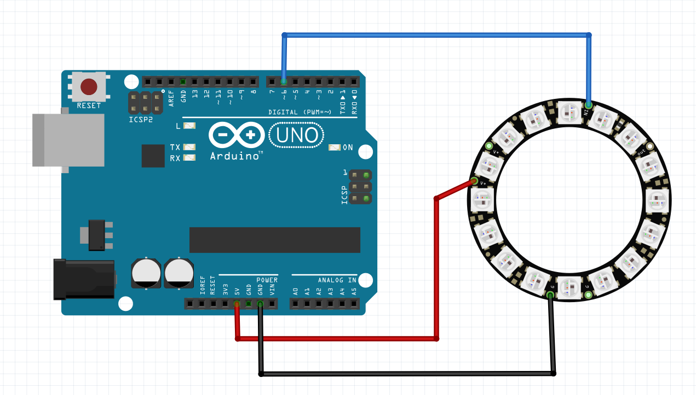
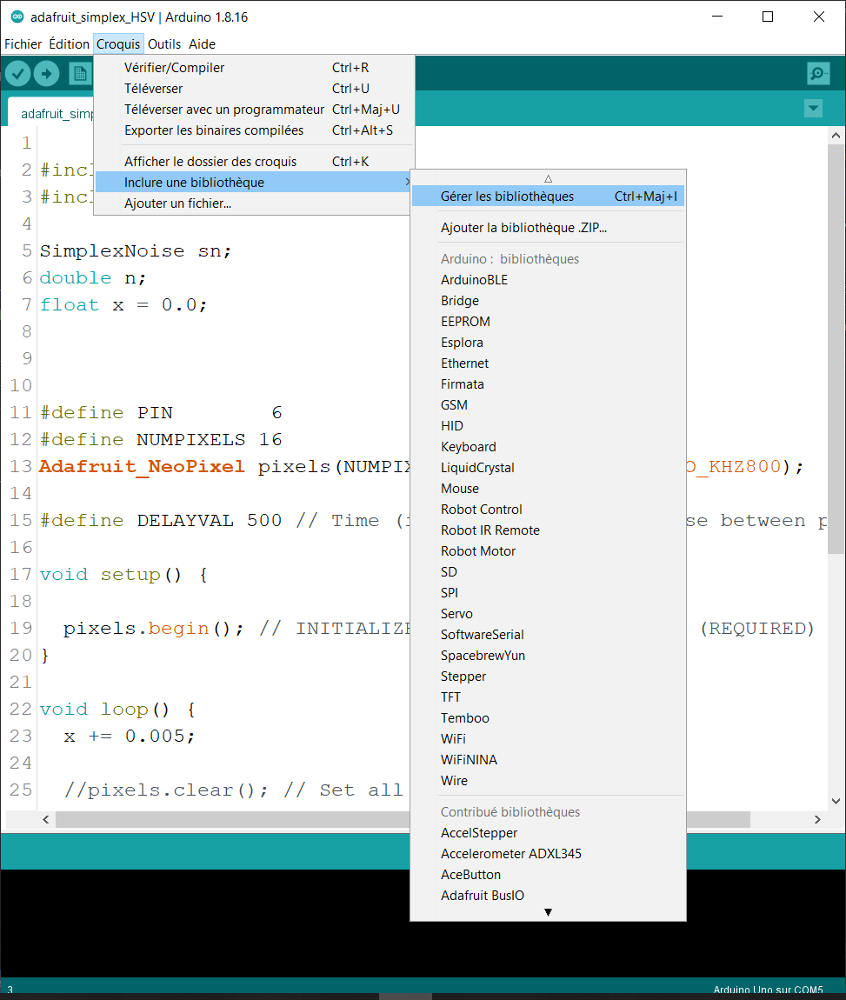
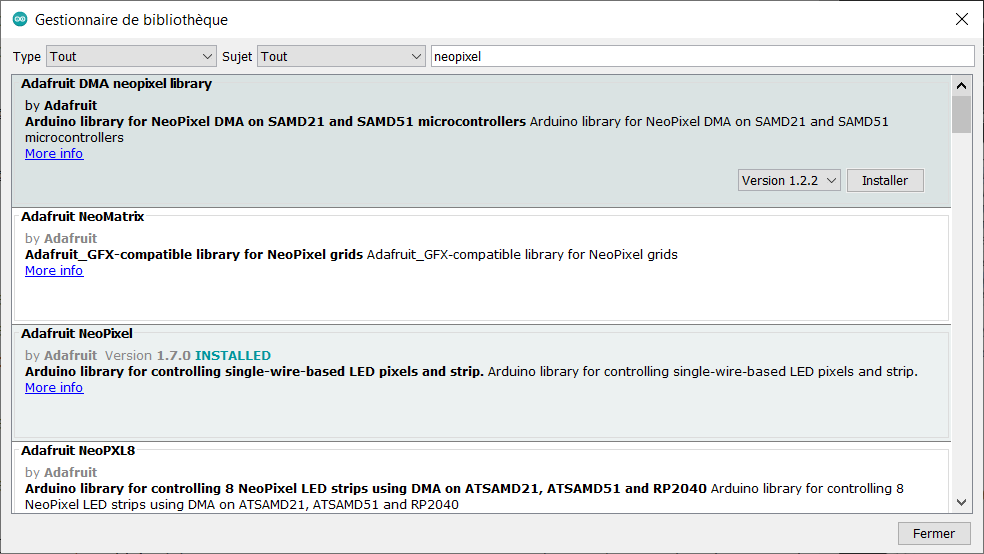
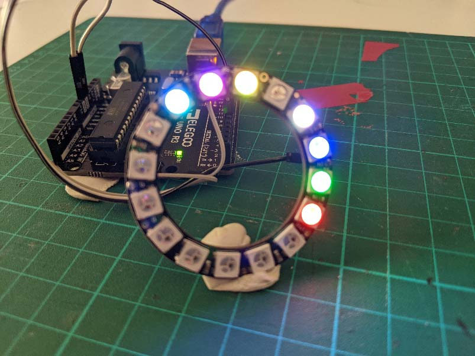
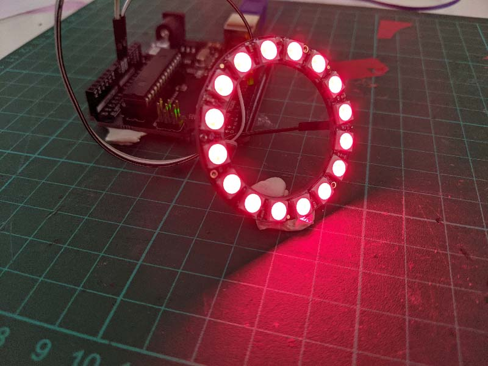
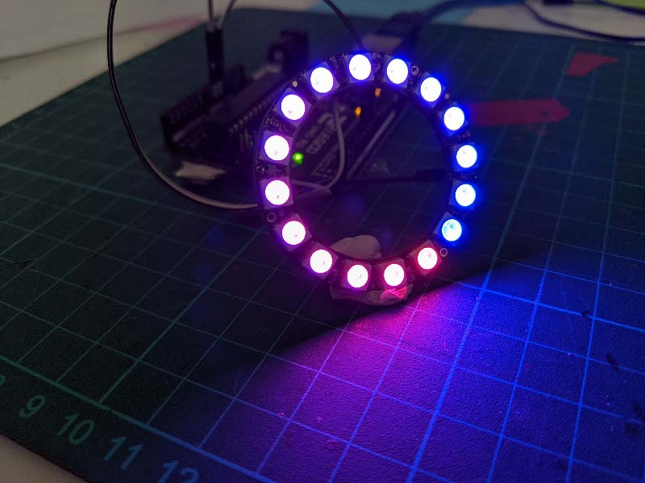

# arduino_led_animation

A crash course focused on led animation with arduino for designers

Dans ce document nous allons nous concentrer sur la création d'animations basées sur une timeline qui se joueront sur des leds de type neopixels; comme présenté ci-dessous :

GIF à Intégrer

Cette ressource n'a pas vocation à être une introduction à arduino, vous pourrez trouver une ressource plus générale sur arduino et suivant ce lien : https://github.com/b2renger/Introduction_Arduino

Il peut-être intéressant de lire l'introduction du lien ci-dessus si vous ne connaissez absolument pas arduino avant de continuer; notament si vous souhaitez découvrir l'anatomie d'une carte arduino, les principes de base des broches d'entrée et sortie, ainsi que le logiciel permettant de programmer les cartes.


## Brancher un anneau ou ruban de Leds

Il faut comprendre qu'un anneau de leds consomme du courant et qu'une carte arduino ne peut fournir qu'une certaine quantité de courant, et donc à partir d'un certain nombre il faudra avoir recours à une alimentation externe. Mais nous détaillerons ça plus tard.

Commençons donc par brancher notre premier anneau, directement sur la carte :



Nous pouvons maintenant ouvrir le logiciel [arduino](https://www.arduino.cc/en/software), afin de programmer !

### Installation de la bibliothèque

Afin de pouvoir adresser des couleurs aux leds il faut utiliser une bibliothèque logicielle dédiée au type de leds utiliser.

Il faut donc l'installer via **le gestionnaire de bibliothèques**, accessible depuis le menu *Croquis* -> *Inclure une bibliothèque* -> *Gérer les bibliothèques*.



Puis, dans le champ de recherche taper "neopixels" et choisir la bibliothèque *Adafruit NeoPixel*



### Programmer les leds manuellement

Pour commencer à produire de la lumière le plus simple est d'adresser les leds manuellement en utilisant l'index de la led que nous voulons éclairer. L'index étant un chiffre correspondant au numéro de la led sur l'anneau.


```c
// inclure la bibliothèque nécessaire
#include <Adafruit_NeoPixel.h>

// initialiser l'anneau de leds avec 16 leds connectés sur la pin 6
#define NUMPIXELS 16

Adafruit_NeoPixel ring1 = Adafruit_NeoPixel(NUMPIXELS, 6, NEO_GRB + NEO_KHZ800); 
// notre anneau est maintenant représenté par l'alias "ring1"

void setup() {
  // intialiser l'anneau  
  ring1.begin(); 
}

void loop() {
    // donner une couleur à certains pixels en RGB (max = 255)
    // 0 -> rouge
    ring1.setPixelColor(0, ring1.Color(255, 0, 0)); 

    // 1 -> vert
    ring1.setPixelColor(1, ring1.Color(0, 255, 0)); 
    // 2 -> bleu
    ring1.setPixelColor(2, ring1.Color(0, 0, 255));
    // 3 -> blanc
    ring1.setPixelColor(3, ring1.Color(255, 255, 255)); 
    // 4 -> noir
    ring1.setPixelColor(4, ring1.Color(0, 0, 0)); // noir
    // 5 -> jaune
    ring1.setPixelColor(5, ring1.Color(255, 255, 0));
    // 6 -> rose
    ring1.setPixelColor(6, ring1.Color(255, 0, 255));
    // 7 -> turquoise
    ring1.setPixelColor(6, ring1.Color(0, 255, 255));
    // on actualise le ruban de led 
    ring1.show(); 
}
```

Vous devriez alors obtenir ce résultat :


Rien que pour 16 leds ce processus est un peu fastidieu; imaginez alors en avoir 32 ou 400 ! et ne parlons même pas des animations potentielles que nous souhaiterions créer ... 

### Utiliser une boucle pour assigner toutes les leds

En programmation nous pouvons utiliser une **boucle for** pour répéter une action plusieures fois.

Une boucle for s'écrit comme cela :

```c
for ( /* conditions à remplir */ ){
  /*
  code à éxécuter tant que les conditions sont vérifiées
  */
}
```

il est donc important de bien identifier les parenthèses - qui servent à délimiter les conditions d'éxécution du code, qui lui est entre accolades.

D'un point de vue pratique, les conditions vont être exprimée en 3 étapes :

- on va créer une variable (ici un nombre entier) et on va lui donner une valeur de démarrage :
  ```
  int cpt = 0;
  ```
  => notre variable s'appelle 'cpt' (pour compteur), et elle vaut zéro au début.

- on exprime ensuite la condition d'arrêt :
  ```
  cpt < 30;
  ```
  => si jamais i dépasse 29 on s'arrête et on sort de la boucle for; on continuera alors l'éxécution du programme de manière séquentielle (ligne par ligne).

- finalement on définit la manière dont notre compteur évolue après chaque éxécution du code entre accolades, par exemple :
  ```
  cpt = cpt + 5;
  ```
  => à chaque fois que le code est éxécuté on augmente notre variable cpt de 5.

Du coup, en écrivant : 
  ```c
  for (int cpt = 0 ; cpt < 30 ; cpt = cpt +5){

  }
  ```
Le code entre les accolades, sera éxécuté :
  - un première fois avec cpt valant 0
  - une deuxième fois avec cpt valant 5
  - etc
  - un cinquième fois avec cpt valant 25

A la sixième fois *cpt* vaudra 30 et ne sera donc plus strictement inférieur à 30. On sortira alors de la boucle pour éxécuter le code directement en dessous.

Si nous appliquons cela à nos leds, cela donne :

```c
// inclure la bibliothèque nécessaire
#include <Adafruit_NeoPixel.h>

// initialiser l'anneau de leds avec 16 leds connectés sur la pin 6
#define NUMPIXELS 16

Adafruit_NeoPixel ring1 = Adafruit_NeoPixel(NUMPIXELS, 6, NEO_GRB + NEO_KHZ800);
// notre anneau est maintenant représenté par l'alias "ring1"

void setup() {
  // intialiser l'anneau
  ring1.begin();
}

void loop() {
  // on répéte une ligne de code pour chaque led
  // c'est à dire de la led à l'index 0 jusqu'à la led 15.
  for (int i = 0 ; i < NUMPIXELS ; i ++) {
    // pour la led à l'index i, on lui applique la couleur rouge
    ring1.setPixelColor(i, ring1.Color(255, 0, 0));
  }
  ring1.show();
}

```
Traditionellement, on utilise *i* car c'est plus court à écrire que *cpt*, mais on peut utiliser n'importe quel lettre ou mot.



Du coup on peut utiliser la valeur de notre compteur pour créer des dégradés. On peut utiliser la valeur que prend *i* à chaque répétition (dans notre cas elle augmente de 1), pour calculer d'autres nombres que l'on pourra utiliser pour nos composantes rgb.

```c
// inclure la bibliothèque nécessaire
#include <Adafruit_NeoPixel.h>

// initialiser l'anneau de leds avec 16 leds connectés sur la pin 6
#define NUMPIXELS 16

Adafruit_NeoPixel ring1 = Adafruit_NeoPixel(NUMPIXELS, 6, NEO_GRB + NEO_KHZ800);
// notre anneau est maintenant représenté par l'alias "ring1"

void setup() {
  // intialiser l'anneau
  ring1.begin();
}

void loop() {
  // on répéte une ligne de code pour chaque led
  // c'est à dire de la led à l'index 0 jusqu'à la led 15.
  for (int i = 0 ; i < NUMPIXELS ; i ++) {
    // pour la led à l'index i, on lui applique une couleur
    // dominante bleue, mais dont la composante rouge augmente
    // au fur et à mesure jusqu'à 255 et dont la composante
    // bleue diminue jusqu'à 0
    // map permet de calculer pour i compris entre 0 et NUMPIXELS
    // une valeur a comprise entre 0 et 255.
    int a = map(i, 0, NUMPIXELS, 0, 255);
    int b = 255 - a;
    ring1.setPixelColor(i, ring1.Color(a, 0, b));
  }
  ring1.show();
}
```
Ici la fonction map permet de faire un calcul qui est une simple règle de proportionalité (ou règle de trois)

On range dans une variable appelée *a*, le résultat du calcul effectué par [*map*](https://www.arduino.cc/reference/en/language/functions/math/map/), puis on utilise cette variable pour la composante rouge de notre calcul.
On calcule aussi une variable appelée *b* qui sera le "miroir" de *a* par rapport à la valeur max de 255.




### Le mode de couleur HSB

Le mode RGB a ses limites, il permet de faire beaucoup de choses, mais il existe un autre mode appelé HSB pour : Hue Saturation Brightness. Cela signifie qu'en lieu et place de spécifier les composantes rouges, vertes et bleues, nous pouvons définir des couleur grâce à leur teinte, leur saturation et leur luminosité.

- la teinte est traditionellement exprimée entre 0 et 360 dans les sélécteurs de couleurs que vous pourez trouver en ligne. Ici elle sera exprimée entre 0 et 65535 (soit 2 puissance 16 pour avoir une finisse de sélection 16 bit).
- la saturation qui représente en réalité l'intensité des couleurs est traditionellement exprimée entre 0 et 100 ici elle sera exprimée entre 0 et 255. Si la saturation est à 0 nous aurons du blanc et si elle est à 255 nous aurons des couleurs pleines - très saturées.
- la luminosité est aussi traditionnellement exprimée entre 0 et 100 et encore une fois elle sera ici exprimée entre 0 et 255. Si la luminosité est à 0 nous aurons des leds éteintes (noires), si elle est à 255 nous aurons des leds allumées au maximum de leur puissance.

Il est alors très facile de créer un dégradé de teinte en utilisant une boucles for :

```c
// inclure la bibliothèque nécessaire
#include <Adafruit_NeoPixel.h>

// initialiser l'anneau de leds avec 16 leds connectés sur la pin 6
#define NUMPIXELS 16

Adafruit_NeoPixel ring1 = Adafruit_NeoPixel(NUMPIXELS, 6, NEO_GRB + NEO_KHZ800);
// notre anneau est maintenant représenté par l'alias "ring1"

void setup() {
  // intialiser l'anneau
  ring1.begin();
}

void loop() {
  // on répéte une ligne de code pour chaque led
  // c'est à dire de la led à l'index 0 jusqu'à la led 15.
  for (int i = 0 ; i < NUMPIXELS ; i ++) {
    int teinte = map(i, 0, NUMPIXELS, 0, 65535);
    uint32_t rgbcolor = ring1.ColorHSV(teinte, 255,255);
    ring1.setPixelColor(i, rgbcolor);
  }
  ring1.show();
}
```


Il est aussi possible de faire un dégradé de saturation ou de luminosité. Mais attention obtenir un dégradé qui perceptuellement soit valable il faut utiliser une correction gamma (suivez [ce lien pour en savoir plus](https://learn.adafruit.com/led-tricks-gamma-correction))


```c
// inclure la bibliothèque nécessaire
#include <Adafruit_NeoPixel.h>

#define NUMPIXELS 16

// initialiser l'anneau de leds avec 16 leds connectés sur la pin 6
Adafruit_NeoPixel ring1 = Adafruit_NeoPixel(NUMPIXELS, 6, NEO_GRB + NEO_KHZ800);
// notre anneau est maintenant représenté par l'alias "ring1"

void setup() {
  // intialiser l'anneau
  ring1.begin();
}

void loop() {
  // on répéte une ligne de code pour chaque led
  // c'est à dire de la led à l'index 0 jusqu'à la led 15.
  for (int i = 0 ; i < NUMPIXELS ; i ++) {
    int sat = map(i, 0, NUMPIXELS, 0, 255);
    //uint32_t rgbcolor = ring1.ColorHSV(0, sat,255); // sans correction
    uint32_t rgbcolor = ring1.gamma32(ring1.ColorHSV(0, sat, 255));// avec correction
    ring1.setPixelColor(i, rgbcolor);
  }
  ring1.show();
}
```
Sans correction :


Avec correction :


## La bibliothèque Tween

### Timeline

### Les transitions RGB vs HSB


## Programmation avancée

### Animation radiale

### Noise


## Brancher et assigner plusieurs anneaux


## Branchement avec une alimentation externe

