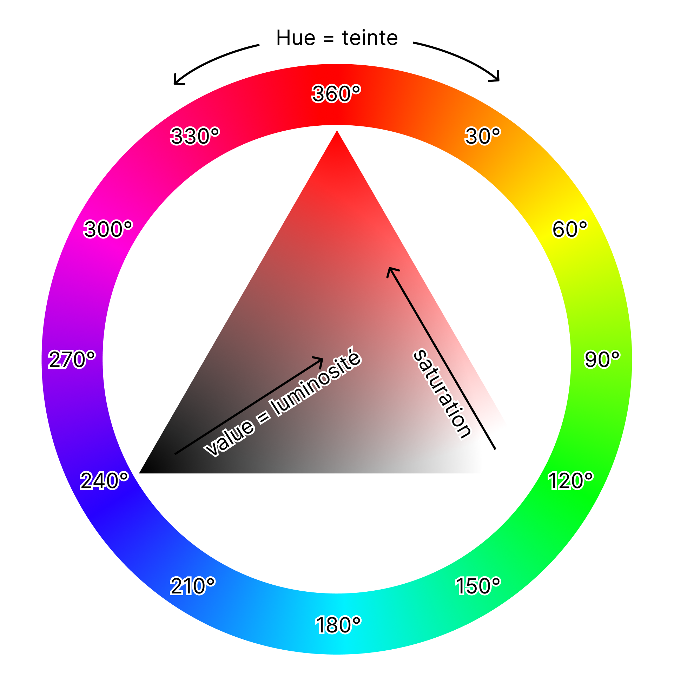
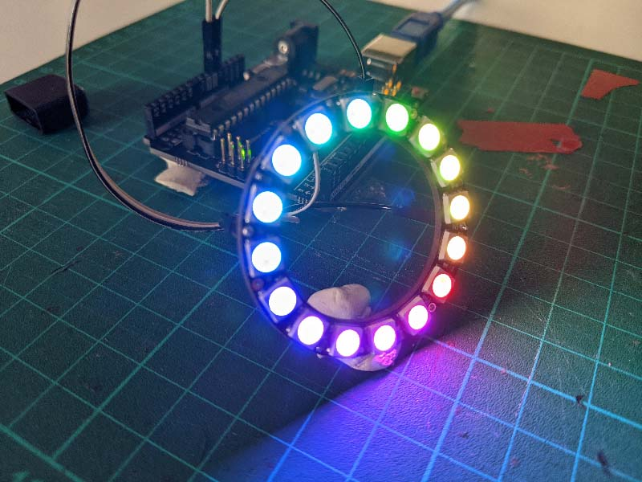
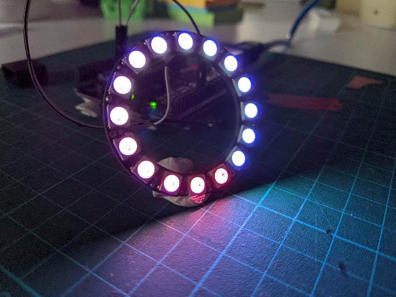
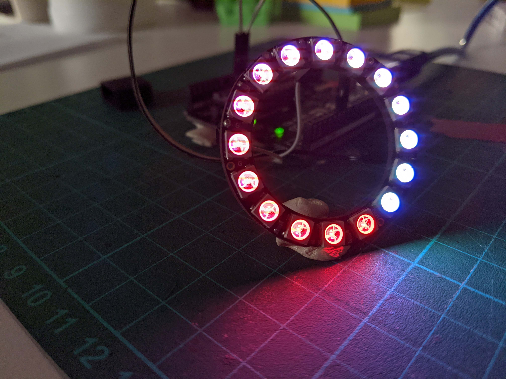
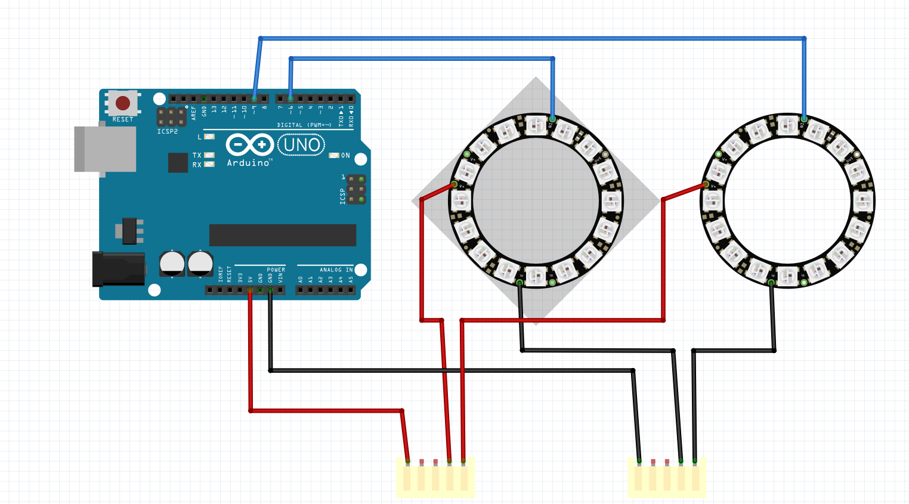
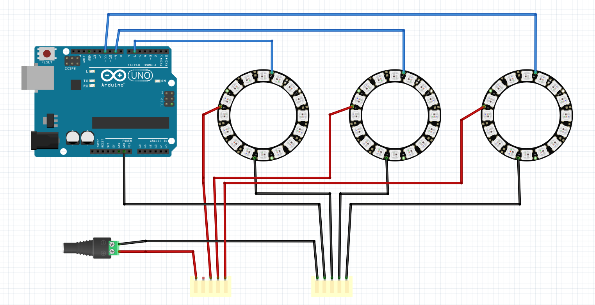

A crash course focused on led animation with arduino for designers

In this document we will focus on creating timeline-based animations that will play on neopixel-type LEDs;

This resource is not intended to be an introduction to arduino, you can find a more general resource on arduino by following this link: https://github.com/b2renger/Introduction_Arduino

It may be interesting to read the introduction from the link above if you are not familiar with arduino at all before continuing; especially if you want to discover the anatomy of an arduino board, the basic principles of input and output pins, as well as the software used to program the boards.


<details>
  <summary><strong>TL;DR</strong> </summary>
  - connect a ring or strip of 16 LEDs using pin 6 for "data in"
  - have arduino and the adafruit neopixel library installed

  ```c
// the library for LEDs
#include <Adafruit_NeoPixel.h>

// the data structure to store colors
struct Vec3 {
  float c1;
  float c2;
  float c3;
  Vec3()
    : c1(0), c2(0), c3(0) {}
  Vec3(const float c1, const float c2, const float c3)
    : c1(c1), c2(c2), c3(c3) {}
};

// some color definitions
Vec3 blue = Vec3(0, 200, 255);
Vec3 orange = Vec3(255, 105, 0);
Vec3 black = Vec3(0, 0, 0);
Vec3 pink = Vec3(220, 0, 120);

// LED initialization
#define NUMPIXELS 16
Adafruit_NeoPixel ring1(NUMPIXELS, 6, NEO_GRB + NEO_KHZ800); // number of LEDs, arduino pin, LED type


void setup() {

  ring1.begin();// start the ring


}

void loop() {
  // time management
  long totalTime = 5000; // total animation time
  long dur = millis() % totalTime; // timing

  // create transitions - your turn to play
  transition_lin(&ring1, NUMPIXELS, dur, 0, 2500, black, blue);
  transition_lin(&ring1, NUMPIXELS, dur, 2500, 5000, blue, black);

  ring1.show();
}

// all available transitions below
void animation_radiale(Adafruit_NeoPixel *strip, int n, float t, float startT, float endT) {
  if (t > startT && t < endT) {
    int currentTime = map(t, startT, endT, 0, 1000);
    int ledsOffset = map(currentTime, 0, 1000, 0, n * 8); // 8 represents the number of turns during the animation duration
    for (int i = 0 ; i < n ; i++) {
      float teinteHSB = map(i, 0, n, 100, 235); // we want a hue between 100 and 235 for our gradient 
      float teinteLeds = map(teinteHSB, 0, 360, 0, 65535); // we transform to the LED reference frame 
      strip->setPixelColor((i + ledsOffset) % n, strip->gamma32(strip->ColorHSV(teinteLeds, 255, 255))); // we apply the color
    }
  }
}


// no transition: a fixed color for a duration
void fixed_color(Adafruit_NeoPixel *strip, int n, float t, float startT, float endT, Vec3 c) {
  if (t > startT && t < endT) {
    int currentTime = map(t, startT, endT, 0, 1000);
    for (int i = 0; i < n ; i++) {
      strip->setPixelColor(i, strip->Color(c.c1, c.c2, c.c3));
    }
  }
}

// linear transition from one color to another over a given duration
void transition_lin(Adafruit_NeoPixel *strip, int n, float t, float startT, float endT, Vec3 startC, Vec3 endC) {
  if (t > startT && t < endT) {
    int currentTime = map(t, startT, endT, 0, 1000);
    float r = map(currentTime, 0, 1000, startC.c1, endC.c1);
    float g = map(currentTime, 0, 1000, startC.c2, endC.c2);
    float b = map(currentTime, 0, 1000, startC.c3, endC.c3);
    for (int i = 0; i < n ; i++) {
      strip->setPixelColor(i, strip->Color(r, g, b));
    }
  }
}

// transitions: https://easings.net/
// sine transition
void transition_sine_InOut(Adafruit_NeoPixel *strip, int n, float t, float startT, float endT, Vec3 startC, Vec3 endC) {
  if (t > startT && t < endT) {
    float currentTime = map(t, startT, endT, 0, 1000) / 1000.;
    float t = -(cos(PI * currentTime) - 1) / 2.;
    float r = map(t * 1000, 0, 1000, startC.c1, endC.c1);
    float g = map(t * 1000, 0, 1000, startC.c2, endC.c2);
    float b = map(t * 1000, 0, 1000, startC.c3, endC.c3);
    for (int i = 0; i < n ; i++) {
      strip->setPixelColor(i, strip->Color(r, g, b));
    }
  }
}
void transition_sine_In(Adafruit_NeoPixel *strip, int n, float t, float startT, float endT, Vec3 startC, Vec3 endC) {
  if (t > startT && t < endT) {
    float currentTime = map(t, startT, endT, 0, 1000) / 1000.;
    float t = 1 - cos((currentTime * PI) / 2.);
    float r = map(t * 1000, 0, 1000, startC.c1, endC.c1);
    float g = map(t * 1000, 0, 1000, startC.c2, endC.c2);
    float b = map(t * 1000, 0, 1000, startC.c3, endC.c3);
    for (int i = 0; i < n ; i++) {
      strip->setPixelColor(i, strip->Color(r, g, b));
    }
  }
}
void transition_sine_Out(Adafruit_NeoPixel *strip, int n, float t, float startT, float endT, Vec3 startC, Vec3 endC) {
  if (t > startT && t < endT) {
    float currentTime = map(t, startT, endT, 0, 1000) / 1000.;
    float t = sin((currentTime * PI) / 2);
    float r = map(t * 1000, 0, 1000, startC.c1, endC.c1);
    float g = map(t * 1000, 0, 1000, startC.c2, endC.c2);
    float b = map(t * 1000, 0, 1000, startC.c3, endC.c3);
    for (int i = 0; i < n ; i++) {
      strip->setPixelColor(i, strip->Color(r, g, b));
    }
  }
}
// Circular transition
void transition_circ_InOut(Adafruit_NeoPixel *strip, int n, float t, float startT, float endT, Vec3 startC, Vec3 endC) {
  if (t > startT && t < endT) {
    float currentTime = map(t, startT, endT, 0, 1000) / 1000.;
    float t = currentTime < 0.5 ? (1 - sqrt(1 - pow(2 * currentTime, 2))) / 2 : (sqrt(1 - pow(-2 * currentTime + 2, 2)) + 1) / 2;
    float r = map(t * 1000, 0, 1000, startC.c1, endC.c1);
    float g = map(t * 1000, 0, 1000, startC.c2, endC.c2);
    float b = map(t * 1000, 0, 1000, startC.c3, endC.c3);
    for (int i = 0; i < n ; i++) {
      strip->setPixelColor(i, strip->Color(r, g, b));
    }
  }
}
void transition_circ_In(Adafruit_NeoPixel *strip, int n, float t, float startT, float endT, Vec3 startC, Vec3 endC) {
  if (t > startT && t < endT) {
    float currentTime = map(t, startT, endT, 0, 1000) / 1000.;
    float t = 1 - sqrt(1 - pow(currentTime, 2));
    float r = map(t * 1000, 0, 1000, startC.c1, endC.c1);
    float g = map(t * 1000, 0, 1000, startC.c2, endC.c2);
    float b = map(t * 1000, 0, 1000, startC.c3, endC.c3);
    for (int i = 0; i < n ; i++) {
      strip->setPixelColor(i, strip->Color(r, g, b));
    }
  }
}
void transition_circ_Out(Adafruit_NeoPixel *strip, int n, float t, float startT, float endT, Vec3 startC, Vec3 endC) {
  if (t > startT && t < endT) {
    float currentTime = map(t, startT, endT, 0, 1000) / 1000.;
    float t =  sqrt(1 - pow(currentTime - 1, 2));
    float r = map(t * 1000, 0, 1000, startC.c1, endC.c1);
    float g = map(t * 1000, 0, 1000, startC.c2, endC.c2);
    float b = map(t * 1000, 0, 1000, startC.c3, endC.c3);
    for (int i = 0; i < n ; i++) {
      strip->setPixelColor(i, strip->Color(r, g, b));
    }
  }
}
// Exponential transition
void transition_expo_InOut(Adafruit_NeoPixel *strip, int n, float t, float startT, float endT, Vec3 startC, Vec3 endC) {
  if (t > startT && t < endT) {
    float currentTime = map(t, startT, endT, 0, 1000) / 1000.;
    float t =  currentTime == 0
               ? 0
               : currentTime == 1
               ? 1
               : currentTime < 0.5 ? pow(2, 20 * currentTime - 10) / 2
               : (2 - pow(2, -20 * currentTime + 10)) / 2;
    float r = map(t * 1000, 0, 1000, startC.c1, endC.c1);
    float g = map(t * 1000, 0, 1000, startC.c2, endC.c2);
    float b = map(t * 1000, 0, 1000, startC.c3, endC.c3);
    for (int i = 0; i < n ; i++) {
      strip->setPixelColor(i, strip->Color(r, g, b));
    }
  }
}
void transition_expo_Out(Adafruit_NeoPixel *strip, int n, float t, float startT, float endT, Vec3 startC, Vec3 endC) {
  if (t > startT && t < endT) {
    float currentTime = map(t, startT, endT, 0, 1000) / 1000.;
    float t =  currentTime == 1 ? 1 : 1 - pow(2, -10 * currentTime);
    float r = map(t * 1000, 0, 1000, startC.c1, endC.c1);
    float g = map(t * 1000, 0, 1000, startC.c2, endC.c2);
    float b = map(t * 1000, 0, 1000, startC.c3, endC.c3);
    for (int i = 0; i < n ; i++) {
      strip->setPixelColor(i, strip->Color(r, g, b));
    }
  }
}
void transition_expo_In(Adafruit_NeoPixel *strip, int n, float t, float startT, float endT, Vec3 startC, Vec3 endC) {
  if (t > startT && t < endT) {
    float currentTime = map(t, startT, endT, 0, 1000) / 1000.;
    float t =   currentTime == 0 ? 0 : pow(2, 10 * currentTime - 10);
    float r = map(t * 1000, 0, 1000, startC.c1, endC.c1);
    float g = map(t * 1000, 0, 1000, startC.c2, endC.c2);
    float b = map(t * 1000, 0, 1000, startC.c3, endC.c3);
    for (int i = 0; i < n ; i++) {
      strip->setPixelColor(i, strip->Color(r, g, b));
    }
  }
}

void chatoiement(Adafruit_NeoPixel *strip, int n, float t, float startT, float endT, float h1, float h2) {
  if (t > startT && t < endT) {
    int currentTime = map(t, startT, endT, 0, 1000);
    x += 0.005; // x and y only increment during the animation
    y += 0.001;
    for (int i = 0; i < n; i++) {
      nx = sn.noise(x, i);
      int valeur = map(nx * 100, -100, 100, 0, 255);  //the LED value shimmers between 0 and 255
      ny = sn.noise(y, i * 2);
      int teinte = map(ny * 100, -100, 100, h1, h2);                                   //the hue is between values h1 and h2 in the function arguments
      int teinte1 = map(teinte, 0, 360, 0, 65535);                                     // we transform to the LED reference frame
      strip->setPixelColor(i, strip->gamma32(strip->ColorHSV(teinte1, 255, valeur)));  // we apply the color
    }
  }
}

void chatoiement_valeur(Adafruit_NeoPixel *strip, int n, float t, float startT, float endT, float h1, float h2, float valeur1, float valeur2) {
  if (t > startT && t < endT) {
    int currentTime = map(t, startT, endT, 0, 1000);
    x += 0.005; // x and y only increment during the animation
    y += 0.001;
    for (int i = 0; i < n; i++) {
      nx = sn.noise(x, i);
      float valeur = map(currentTime, 0, 1000, valeur1, valeur2);     //the value goes from valeur1 to valeur2 during the transition duration
      float noiseValeur = map(nx * 100, -100, 100, 0, 1000) / 1000.;  //we create noise between 0 and 1 for the final value
      ny = sn.noise(y, i * 2);
      int teinte = map(ny * 100, -100, 100, h1, h2);  //the hue is between values h1 and h2 in the function arguments
      int teinte1 = map(teinte, 0, 360, 0, 65535);
      strip->setPixelColor(i, strip->gamma32(strip->ColorHSV(teinte1, 255, noiseValeur * valeur)));  // we apply the color with the value that shimmers and goes from valeur1 to valeur2
    }
  }
}

void chatoiement_color(Adafruit_NeoPixel *strip, int n, float t, float startT, float endT, float h_debut_1, float h_debut_2, float h_fin_1, float h_fin_2) {
  if (t > startT && t < endT) {
    int currentTime = map(t, startT, endT, 0, 1000);
    x += 0.005; // x and y only increment during the animation
    y += 0.001;
    for (int i = 0; i < n; i++) {
      nx = sn.noise(x, i);
      int valeur = map(nx * 100, -100, 100, 0, 255);  //the LED value shimmers between 0 and 255
      ny = sn.noise(y, i * 2);
      int h1 = map(currentTime, 0, 1000, h_debut_1, h_fin_1);
      int h2 = map(currentTime, 0, 1000, h_debut_2, h_fin_2);
      int teinte = map(ny * 100, -100, 100, h1, h2);  //
      int teinteFinale = map(teinte, 0, 360, 0, 65535);
      strip->setPixelColor(i, strip->gamma32(strip->ColorHSV(teinteFinale, 255, valeur)));  // we apply the color with the value that shimmers and goes from valeur1 to valeur2
    }
  }
}

``` 
  

</details>


## Contents

<!-- vscode-markdown-toc -->
1. [Connecting an LED ring or strip](#ConnectinganLEDringorstrip)
	* 1.1. [Library installation](#Libraryinstallation)
	* 1.2. [Programming LEDs manually](#ProgrammingLEDsmanually)
	* 1.3. [Using a loop to assign all LEDs](#UsingalooptoassignallLEDs)
	* 1.4. [HSB color mode](#HSBcolormode)
2. [Advanced programming](#Advancedprogramming)
	* 2.1. [Radial animation](#Radialanimation)
	* 2.2. [Noise](#Noise)
3. [Creating transitions](#Creatingtransitions)
	* 3.1. [Code structures to know how to use](#Codestructurestoknowhowtouse)
		* 3.1.1. [A structure to store colors](#Astructuretostorecolors)
		* 3.1.2. [Managing time](#Managingtime)
		* 3.1.3. [Functions to create transitions](#Functionstocreatetransitions)
	* 3.2. [Available transitions](#Availabletransitions)
	* 3.3. [Simple transition](#Simpletransition)
	* 3.4. [A complete transition program for a ring](#Acompletetransitionprogramforaring)
	* 3.5. [Alternating solid color transitions and pixel-by-pixel animations](#Alternatingsolidcolortransitionsandpixel-by-pixelanimations)
4. [Connecting and assigning multiple rings](#Connectingandassigningmultiplerings)
	* 4.1. [Two rings - arduino power supply](#Tworings-arduinopowersupply)
	* 4.2. [Two rings - complete example](#Tworings-completeexample)
	* 4.3. [Three rings - external power supply](#Threerings-externalpowersupply)

<!-- vscode-markdown-toc-config
	numbering=true
	autoSave=true
	/vscode-markdown-toc-config -->
<!-- /vscode-markdown-toc -->


##  1. <a name='ConnectinganLEDringorstrip'></a>Connecting an LED ring or strip

You need to understand that an LED ring consumes current and an arduino board can only provide a certain amount of current, so after a certain number you will need to use an external power supply. But we'll detail that later.

So let's start by connecting our first ring, directly to the board:


We can now open the [arduino](https://www.arduino.cc/en/software) software to program!

[**^ Home**](#Contents)

###  1.1. <a name='Libraryinstallation'></a>Library installation

In order to address colors to the LEDs, you need to use a software library dedicated to the type of LEDs being used.

You need to install it via the **library manager**, accessible from the *Sketch* menu -> *Include Library* -> *Manage Libraries*.


Then, in the search field type "neopixels" and choose the *Adafruit NeoPixel* library


[**^ Home**](#Contents)

###  1.2. <a name='ProgrammingLEDsmanually'></a>Programming LEDs manually

To start producing light, the simplest approach is to address the LEDs manually using the index of the LED we want to light up. The index being a number corresponding to the LED number on the ring.


```c
// include the necessary library
#include <Adafruit_NeoPixel.h>

// initialize the LED ring with 16 LEDs connected to pin 6
#define NUMPIXELS 16

Adafruit_NeoPixel ring1 = Adafruit_NeoPixel(NUMPIXELS, 6, NEO_GRB + NEO_KHZ800); 
// our ring is now represented by the alias "ring1"

void setup() {
  // initialize the ring  
  ring1.begin(); 
}

void loop() {
    // give a color to certain pixels in RGB (max = 255)
    // 0 -> red
    ring1.setPixelColor(0, ring1.Color(255, 0, 0)); 

    // 1 -> green
    ring1.setPixelColor(1, ring1.Color(0, 255, 0)); 
    // 2 -> blue
    ring1.setPixelColor(2, ring1.Color(0, 0, 255));
    // 3 -> white
    ring1.setPixelColor(3, ring1.Color(255, 255, 255)); 
    // 4 -> black
    ring1.setPixelColor(4, ring1.Color(0, 0, 0)); // black
    // 5 -> yellow
    ring1.setPixelColor(5, ring1.Color(255, 255, 0));
    // 6 -> pink
    ring1.setPixelColor(6, ring1.Color(255, 0, 255));
    // 7 -> turquoise
    ring1.setPixelColor(6, ring1.Color(0, 255, 255));
    // we update the LED strip 
    ring1.show(); 
}
```

You should then get this result:


Just for 16 LEDs this process is a bit tedious; imagine having 32 or 400! And let's not even talk about potential animations we might want to create... 

[**^ Home**](#Contents)

###  1.3. <a name='UsingalooptoassignallLEDs'></a>Using a loop to assign all LEDs

In programming we can use a **for loop** to repeat an action multiple times.

A for loop is written like this:

```c
for ( /* conditions to be met */ ){
  /*
  code to execute as long as the conditions are verified
  */
}
```

it is therefore important to identify the parentheses - which serve to delimit the execution conditions of the code, which is between braces.

From a practical point of view, the conditions will be expressed in 3 steps:

- we will create a variable (here an integer) and give it a starting value:
  ```
  int cpt = 0;
  ```
  => our variable is called 'cpt' (for counter), and it equals zero at the beginning.

- we then express the stopping condition:
  ```
  cpt < 30;
  ```
  => if cpt ever exceeds 29 we stop and exit the for loop; we will then continue program execution sequentially (line by line).

- finally we define how our counter evolves after each execution of the code between braces, for example:
  ```
  cpt = cpt + 5;
  ```
  => each time the code is executed we increase our variable cpt by 5.

So, by writing: 
  ```c
  for (int cpt = 0 ; cpt < 30 ; cpt = cpt +5){

  }
  ```
The code between the braces will be executed:
  - a first time with cpt equal to 0
  - a second time with cpt equal to 5
  - etc
  - a fifth time with cpt equal to 25

On the sixth time *cpt* will equal 30 and will therefore no longer be strictly less than 30. We will then exit the loop to execute the code directly below.

If we apply this to our LEDs, we get:

```c
// include the necessary library
#include <Adafruit_NeoPixel.h>

// initialize the LED ring with 16 LEDs connected to pin 6
#define NUMPIXELS 16

Adafruit_NeoPixel ring1 = Adafruit_NeoPixel(NUMPIXELS, 6, NEO_GRB + NEO_KHZ800);
// our ring is now represented by the alias "ring1"

void setup() {
  // initialize the ring
  ring1.begin();
}

void loop() {
  // we repeat a line of code for each LED
  // that is from the LED at index 0 to LED 15.
  for (int i = 0 ; i < NUMPIXELS ; i ++) {
    // for the LED at index i, we apply the color red
    ring1.setPixelColor(i, ring1.Color(255, 0, 0));
  }
  ring1.show();
}

```
Traditionally, we use *i* because it's shorter to write than *cpt*, but we can use any letter or word.


So we can use the value of our counter to create gradients. We can use the value that *i* takes at each repetition (in our case it increases by 1), to calculate other numbers that we can use for our rgb components.

```c
// include the necessary library
#include <Adafruit_NeoPixel.h>

// initialize the LED ring with 16 LEDs connected to pin 6
#define NUMPIXELS 16

Adafruit_NeoPixel ring1 = Adafruit_NeoPixel(NUMPIXELS, 6, NEO_GRB + NEO_KHZ800);
// our ring is now represented by the alias "ring1"

void setup() {
  // initialize the ring
  ring1.begin();
}

void loop() {
  // we repeat a line of code for each LED
  // that is from the LED at index 0 to LED 15.
  for (int i = 0 ; i < NUMPIXELS ; i ++) {
    // for the LED at index i, we apply a color
    // dominant blue, but whose red component increases
    // gradually up to 255 and whose blue component
    // decreases to 0
    // map allows us to calculate for i between 0 and NUMPIXELS
    // a value a between 0 and 255.
    int a = map(i, 0, NUMPIXELS, 0, 255);
    int b = 255 - a;
    ring1.setPixelColor(i, ring1.Color(a, 0, b));
  }
  ring1.show();
}
```
Here the map function allows us to do a calculation which is a simple rule of proportionality (or rule of three)

We store in a variable called *a*, the result of the calculation performed by [*map*](https://www.arduino.cc/reference/en/language/functions/math/map/), then we use this variable for the red component of our calculation.
We also calculate a variable called *b* which will be the "mirror" of *a* relative to the max value of 255.


[**^ Home**](#Contents)

###  1.4. <a name='HSBcolormode'></a>HSB color mode

RGB mode has its limitations, it allows you to do many things, but there is another mode called HSB for: Hue Saturation Brightness. This means that instead of specifying red, green and blue components, we can define colors through their hue, saturation and brightness.

- hue is traditionally expressed between 0 and 360 in color selectors you can find online. Here it will be expressed between 0 and 65535 (i.e. 2 to the power of 16 to have 16-bit selection finesse).
- saturation which actually represents the intensity of colors is traditionally expressed between 0 and 100 here it will be expressed between 0 and 255. If saturation is 0 we will have white and if it is 255 we will have full colors - very saturated.
- brightness is also traditionally expressed between 0 and 100 and again it will be expressed here between 0 and 255. If brightness is 0 we will have LEDs turned off (black), if it is 255 we will have LEDs turned on at maximum power.



It is then very easy to create a hue gradient using a for loop:

```c
// include the necessary library
#include <Adafruit_NeoPixel.h>

// initialize the LED ring with 16 LEDs connected to pin 6
#define NUMPIXELS 16

Adafruit_NeoPixel ring1 = Adafruit_NeoPixel(NUMPIXELS, 6, NEO_GRB + NEO_KHZ800);
// our ring is now represented by the alias "ring1"

void setup() {
  // initialize the ring
  ring1.begin();
}

void loop() {
  // we repeat a line of code for each LED
  // that is from the LED at index 0 to LED 15.
  for (int i = 0 ; i < NUMPIXELS ; i ++) {
    int teinte = map(i, 0, NUMPIXELS, 0, 65535);
    uint32_t rgbcolor = ring1.ColorHSV(teinte, 255,255);
    ring1.setPixelColor(i, rgbcolor);
  }
  ring1.show();
}
```



It is also possible to create a saturation or brightness gradient. But be careful to obtain a perceptually valid gradient you need to use gamma correction (follow [this link to learn more](https://learn.adafruit.com/led-tricks-gamma-correction)).

This is often valid for gradients in pastel colors.


```c
// include the necessary library
#include <Adafruit_NeoPixel.h>

#define NUMPIXELS 16

// initialize the LED ring with 16 LEDs connected to pin 6
Adafruit_NeoPixel ring1 = Adafruit_NeoPixel(NUMPIXELS, 6, NEO_GRB + NEO_KHZ800);
// our ring is now represented by the alias "ring1"

void setup() {
  // initialize the ring
  ring1.begin();
}

void loop() {
  // we repeat a line of code for each LED
  // that is from the LED at index 0 to LED 15.
  for (int i = 0 ; i < NUMPIXELS ; i ++) {
    int sat = map(i, 0, NUMPIXELS, 0, 255);
    //uint32_t rgbcolor = ring1.ColorHSV(0, sat,255); // without correction
    uint32_t rgbcolor = ring1.gamma32(ring1.ColorHSV(0, sat, 255));// with correction
    ring1.setPixelColor(i, rgbcolor);
  }
  ring1.show();
}
```
Without correction:



With correction:




[**^ Home**](#Contents)


##  2. <a name='Advancedprogramming'></a>Advanced programming
We will now focus on slightly more complex animations that will assign different values to each LED of a ring.

###  2.1. <a name='Radialanimation'></a>Radial animation

We will create this animation:


The idea is quite simple, we take the gradient principle in HSB mode on the complete ring.

We will then create an offset that will be changed by a timeline.

We will then need to assign the right hue to the right pixel. We will add the *i* from our for loop to our *offset* variable which will therefore increase by 1 between 0 and the number of pixels we have (*NUMPIXELS*).

However, the result of *i+offset* must remain between 0 and NUMPIXELS. The trick for this is to use the *modulo* operator expressed by the '%' character which calculates the remainder of the Euclidean division (simple explanation to come...)

Basically if I do a modulo 16 on a value that increases by 1 with each calculation: I will get a counter that increases by 1 each time and when I reach 16 or multiples of 16 the result will always be zero:

If I do my divisions:
- 0 / 16 => this equals zero and the remainder is 0.
- 1 / 16 => this still equals zero but the remainder is 1. 
- 2 / 16 => still zero but the remainder is 2.
- ...
- 15 / 16 => still zero but the remainder is 15.
- 16 / 16 => the division equals 1 and the remainder is 0.
- 17 / 16 => 1 and the remainder is 1.
- ...
- 31 / 16 => 1 and the remainder is 15.
- 32 / 16 => 2 and the remainder is 0.
- etc.

So:
```
(i + offset) % NUMPIXELS
```
will always give a result between 0 and NUMPIXELS which was our goal.


[**^ Home**](#Contents)

###  2.2. <a name='Noise'></a>Noise

We will now look at another technique, allowing for more organic/undulating renders.


The idea is to use a noise algorithm (which allows you to get random numbers that are coherent with each other).
To give you an idea of what this can give graphically, you can look at this pinterest board: https://www.pinterest.fr/vigo_spooliga/perlin-noise/

For this we will import another new library which is also not available in the arduino manager.

It can be found here: https://github.com/jshaw/SimplexNoise

Like for the *Tween* library you can click on the green *Code* button and choose *download as zip*.

Then in arduino you select the *Sketch* menu then *include a library* and *add the .ZIP library* to be able to choose the zip file you just downloaded.

From a code point of view, it's a bit more complicated to use...

In the animation above we control a hue variation in blue colors and we also control the general brightness of each pixel.

*Noise* is an algorithm that depends on time, so we will need to provide it with variables that increase slowly, the longer these variables increase, the more "smooth" the result will be visually, the faster they increase, the more "jerky" the result will be.

```c

#include <Adafruit_NeoPixel.h>
#include <SimplexNoise.h>

#define PIN        6
#define NUMPIXELS 16
Adafruit_NeoPixel ring1(NUMPIXELS, PIN, NEO_GRB + NEO_KHZ800);

// initialize the library for noise
SimplexNoise sn;

double nx;
double x = 0.0;

double ny;
double y = 0.0;


void setup() {

  ring1.begin(); 

  // get random values at program startup
  x= analogRead(0)/10.;
  y= analogRead(2)/ 10.;
}

void loop() {

  // we increase variables x and y slowly
  x += 0.005;
  y += 0.001;

  // we go through all pixels
  for (int i = 0; i < NUMPIXELS; i++) {

    // we calculate a noise value (between 0 and 1)
    nx = sn.noise(x, i); 
    // we transform this value to a value between 0 and 255
    int br = map(nx * 100, -100, 100, 0, 255); 

    // we do the same with our second value.
    ny = sn.noise(y, i*2);
    // we transform to have values between 160 and 270
    // color wheel reference frame
    int h = map(ny*100, -100, 100, 160, 270);
    // we finally transform to have values between 0 and 65535
    // in the LED ring reference frame.
    int h1 = map(h, 0, 360, 0, 65535);
    
    ring1.setPixelColor(i, ring1.gamma32(ring1.ColorHSV (h1, 255, br)));
  }
  ring1.show();   


}
```
Here you can play with different values to get different renders.
For example:

- *x += 0.005;* : you can change the value 0.005 to a larger or smaller value
- same for *y += 0.001;*
- *nx = sn.noise(x, i);* : try replacing *i* with *i*5* or *i*0.25* and other values
- same for *ny = sn.noise(y, i*2);*


[**^ Home**](#Contents)

##  3. <a name='Creatingtransitions'></a>Creating transitions

To create transitions we will use code that is not necessary to understand, but it is necessary to know how to use!

We will still detail the code a bit for educational purposes for those who want to go a little further.

The idea is to have a data structure to store colors as variables and to have a series of functions that will have direct effects on an LED ring.

You will find at the end of this section a complete and functional code example that you will only need to modify later.


[**^ Home**](#Contents)

###  3.1. <a name='Codestructurestoknowhowtouse'></a>Code structures to know how to use

####  3.1.1. <a name='Astructuretostorecolors'></a>A structure to store colors

A structure allows you to create a new data type. This data will be three-component vectors because colors have three components whether in RGB or HSB.

Here's what our data structure will look like:
```c
struct Vec3 {
  float c1;
  float c2;
  float c3;
  Vec3()
    : c1(0), c2(0), c3(0) {}
  Vec3(const float c1, const float c2, const float c3)
    : c1(c1), c2(c2), c3(c3) {}
};
```

These few lines of code must be added at the very beginning of your program just after importing the adafruit library for neopixel LEDs.

This structure will allow us to define colors this way:

```c
Vec3 blue = Vec3(0, 200, 255);
Vec3 orange = Vec3(255, 105, 0);
Vec3 black = Vec3(0, 0, 0);
Vec3 pink = Vec3(220, 0, 120);
```

Later we can directly use the color names to display them on our rings.
Just copy/paste a line and modify the components as you wish whether in RGB or HSB.

To find colors expressed in rgb or hsb you can go here:
https://color.adobe.com/en/create/color-wheel

[**^ Home**](#Contents)

####  3.1.2. <a name='Managingtime'></a>Managing time

We will need to manage animation timings, for this we will express all times in milliseconds.

The first thing we need are variables capable of storing the time elapsed since the beginning of the program and looping over a defined time.

These two lines of code should be copied at the beginning of the loop() function:

```c
long totalTime = 5000;
long dur = millis() % totalTime;
```

*totalTime* : allows you to define the time after which we want to loop; here 5000 ms or 5 seconds. You can therefore change the value 5000 to the value needed for your animation.

*dur* : is the current time we will use it to pass to our animation functions so that they can execute in the defined timings.

[**^ Home**](#Contents)

####  3.1.3. <a name='Functionstocreatetransitions'></a>Functions to create transitions

We will be able to create different types of transitions, generally we will use mathematical equations called easing curves that allow transitions with different dynamics.

Generally the code for an easing function looks like this:

```c
// linear transition from one color to another over a given duration
void transition_lin(Adafruit_NeoPixel *strip, int n, float t, float startT, float endT, Vec3 startC, Vec3 endC) {
  if (t > startT && t < endT) {
    int currentTime = map(t, startT, endT, 0, 1000);
    float r = map(currentTime, 0, 1000, startC.c1, endC.c1);
    float g = map(currentTime, 0, 1000, startC.c2, endC.c2);
    float b = map(currentTime, 0, 1000, startC.c3, endC.c3);
    for (int i = 0; i < n ; i++) {
      strip->setPixelColor(i, strip->Color(r, g, b));
    }
  }
}
```
It's not necessary to understand it completely, but you need to understand how to use it :)


We will have different functions available, but it's possible to create others.

To have access to the different transitions you must copy/paste the code below into your program, at the very bottom under the closing brace of *void loop(){}*:

```c

// no transition: a fixed color for a duration
void fixed_color(Adafruit_NeoPixel *strip, int n, float t, float startT, float endT, Vec3 c) {
  if (t > startT && t < endT) {
    int currentTime = map(t, startT, endT, 0, 1000);
    for (int i = 0; i < n ; i++) {
      strip->setPixelColor(i, strip->Color(c.c1, c.c2, c.c3));
    }
  }
}

// linear transition from one color to another over a given duration
void transition_lin(Adafruit_NeoPixel *strip, int n, float t, float startT, float endT, Vec3 startC, Vec3 endC) {
  if (t > startT && t < endT) {
    int currentTime = map(t, startT, endT, 0, 1000);
    float r = map(currentTime, 0, 1000, startC.c1, endC.c1);
    float g = map(currentTime, 0, 1000, startC.c2, endC.c2);
    float b = map(currentTime, 0, 1000, startC.c3, endC.c3);
    for (int i = 0; i < n ; i++) {
      strip->setPixelColor(i, strip->Color(r, g, b));
    }
  }
}

// transitions: https://easings.net/
// sine transition
void transition_sine_InOut(Adafruit_NeoPixel *strip, int n, float t, float startT, float endT, Vec3 startC, Vec3 endC) {
  if (t > startT && t < endT) {
    float currentTime = map(t, startT, endT, 0, 1000) / 1000.;
    float t = -(cos(PI * currentTime) - 1) / 2.;
    float r = map(t * 1000, 0, 1000, startC.c1, endC.c1);
    float g = map(t * 1000, 0, 1000, startC.c2, endC.c2);
    float b = map(t * 1000, 0, 1000, startC.c3, endC.c3);
    for (int i = 0; i < n ; i++) {
      strip->setPixelColor(i, strip->Color(r, g, b));
    }
  }
}
void transition_sine_In(Adafruit_NeoPixel *strip, int n, float t, float startT, float endT, Vec3 startC, Vec3 endC) {
  if (t > startT && t < endT) {
    float currentTime = map(t, startT, endT, 0, 1000) / 1000.;
    float t = 1 - cos((currentTime * PI) / 2.);
    float r = map(t * 1000, 0, 1000, startC.c1, endC.c1);
    float g = map(t * 1000, 0, 1000, startC.c2, endC.c2);
    float b = map(t * 1000, 0, 1000, startC.c3, endC.c3);
    for (int i = 0; i < n ; i++) {
      strip->setPixelColor(i, strip->Color(r, g, b));
    }
  }
}
void transition_sine_Out(Adafruit_NeoPixel *strip, int n, float t, float startT, float endT, Vec3 startC, Vec3 endC) {
  if (t > startT && t < endT) {
    float currentTime = map(t, startT, endT, 0, 1000) / 1000.;
    float t = sin((currentTime * PI) / 2);
    float r = map(t * 1000, 0, 1000, startC.c1, endC.c1);
    float g = map(t * 1000, 0, 1000, startC.c2, endC.c2);
    float b = map(t * 1000, 0, 1000, startC.c3, endC.c3);
    for (int i = 0; i < n ; i++) {
      strip->setPixelColor(i, strip->Color(r, g, b));
    }
  }
}
// Circular transition
void transition_circ_InOut(Adafruit_NeoPixel *strip, int n, float t, float startT, float endT, Vec3 startC, Vec3 endC) {
  if (t > startT && t < endT) {
    float currentTime = map(t, startT, endT, 0, 1000) / 1000.;
    float t = currentTime < 0.5 ? (1 - sqrt(1 - pow(2 * currentTime, 2))) / 2 : (sqrt(1 - pow(-2 * currentTime + 2, 2)) + 1) / 2;
    float r = map(t * 1000, 0, 1000, startC.c1, endC.c1);
    float g = map(t * 1000, 0, 1000, startC.c2, endC.c2);
    float b = map(t * 1000, 0, 1000, startC.c3, endC.c3);
    for (int i = 0; i < n ; i++) {
      strip->setPixelColor(i, strip->Color(r, g, b));
    }
  }
}
void transition_circ_In(Adafruit_NeoPixel *strip, int n, float t, float startT, float endT, Vec3 startC, Vec3 endC) {
  if (t > startT && t < endT) {
    float currentTime = map(t, startT, endT, 0, 1000) / 1000.;
    float t = 1 - sqrt(1 - pow(currentTime, 2));
    float r = map(t * 1000, 0, 1000, startC.c1, endC.c1);
    float g = map(t * 1000, 0, 1000, startC.c2, endC.c2);
    float b = map(t * 1000, 0, 1000, startC.c3, endC.c3);
    for (int i = 0; i < n ; i++) {
      strip->setPixelColor(i, strip->Color(r, g, b));
    }
  }
}
void transition_circ_Out(Adafruit_NeoPixel *strip, int n, float t, float startT, float endT, Vec3 startC, Vec3 endC) {
  if (t > startT && t < endT) {
    float currentTime = map(t, startT, endT, 0, 1000) / 1000.;
    float t =  sqrt(1 - pow(currentTime - 1, 2));
    float r = map(t * 1000, 0, 1000, startC.c1, endC.c1);
    float g = map(t * 1000, 0, 1000, startC.c2, endC.c2);
    float b = map(t * 1000, 0, 1000, startC.c3, endC.c3);
    for (int i = 0; i < n ; i++) {
      strip->setPixelColor(i, strip->Color(r, g, b));
    }
  }
}
// Exponential transition
void transition_expo_InOut(Adafruit_NeoPixel *strip, int n, float t, float startT, float endT, Vec3 startC, Vec3 endC) {
  if (t > startT && t < endT) {
    float currentTime = map(t, startT, endT, 0, 1000) / 1000.;
    float t =  currentTime == 0
                      ? 0
                      : currentTime == 1
                               ? 1
                               : currentTime < 0.5 ? pow(2, 20 * currentTime - 10) / 2
                               : (2 - pow(2, -20 * currentTime + 10)) / 2;
    float r = map(t * 1000, 0, 1000, startC.c1, endC.c1);
    float g = map(t * 1000, 0, 1000, startC.c2, endC.c2);
    float b = map(t * 1000, 0, 1000, startC.c3, endC.c3);
    for (int i = 0; i < n ; i++) {
      strip->setPixelColor(i, strip->Color(r, g, b));
    }
  }
}
void transition_expo_Out(Adafruit_NeoPixel *strip, int n, float t, float startT, float endT, Vec3 startC, Vec3 endC) {
  if (t > startT && t < endT) {
    float currentTime = map(t, startT, endT, 0, 1000) / 1000.;
    float t =  currentTime == 1 ? 1 : 1 - pow(2, -10 * currentTime);
    float r = map(t * 1000, 0, 1000, startC.c1, endC.c1);
    float g = map(t * 1000, 0, 1000, startC.c2, endC.c2);
    float b = map(t * 1000, 0, 1000, startC.c3, endC.c3);
    for (int i = 0; i < n ; i++) {
      strip->setPixelColor(i, strip->Color(r, g, b));
    }
  }
}
void transition_expo_In(Adafruit_NeoPixel *strip, int n, float t, float startT, float endT, Vec3 startC, Vec3 endC) {
  if (t > startT && t < endT) {
    float currentTime = map(t, startT, endT, 0, 1000) / 1000.;
    float t =   currentTime == 0 ? 0 : pow(2, 10 * currentTime - 10);
    float r = map(t * 1000, 0, 1000, startC.c1, endC.c1);
    float g = map(t * 1000, 0, 1000, startC.c2, endC.c2);
    float b = map(t * 1000, 0, 1000, startC.c3, endC.c3);
    for (int i = 0; i < n ; i++) {
      strip->setPixelColor(i, strip->Color(r, g, b));
    }
  }
}

```


###  3.2. <a name='Availabletransitions'></a>Available transitions

Once the code above is copied/pasted, you can create transitions.

The available functions are then:
- fixed_color : for a fixed color
- transition_lin : for a linear transition from one color to another.
- transition_sine_InOut
- transition_sine_In
- transition_sine_Out
- transition_circ_InOut
- transition_circ_In
- transition_circ_Out
- transition_expo_InOut
- transition_expo_In
- transition_expo_Out

You can refer to this page to understand how the different easing functions work: https://easings.net/


[**^ Home**](#Contents)


###  3.3. <a name='Simpletransition'></a>Simple transition

Here we created linear transitions, but it's possible to use **easing** curves that allow you to manage acceleration and deceleration.


When we have the code above in our program, we can then write:

```c
transition_lin(&ring1, NUMPIXELS, dur, 0, 2500, black, blue);
```

To create a light transition:
  - &ring1 -> on the LEDs named ring1
  - NUMPIXELS -> 16 LEDs in our case - cf LED initialization
  - dur -> the current time
  - 0 -> the transition starts when dur equals 0 ms
  - 2500 -> it ends when dur equals 2500 ms
  - it starts at black
  - it ends at blue

Most transitions work this way with these same arguments to specify between the parentheses.

[**^ Home**](#Contents)

###  3.4. <a name='Acompletetransitionprogramforaring'></a>A complete transition program for a ring


```c
// the library for LEDs
#include <Adafruit_NeoPixel.h>

// the data structure to store colors
struct Vec3 {
  float c1;
  float c2;
  float c3;
  Vec3()
    : c1(0), c2(0), c3(0) {}
  Vec3(const float c1, const float c2, const float c3)
    : c1(c1), c2(c2), c3(c3) {}
};

// some color definitions
Vec3 blue = Vec3(0, 200, 255);
Vec3 orange = Vec3(255, 105, 0);
Vec3 black = Vec3(0, 0, 0);
Vec3 pink = Vec3(220, 0, 120);

// LED initialization
#define NUMPIXELS 16
Adafruit_NeoPixel ring1(NUMPIXELS, 6, NEO_GRB + NEO_KHZ800); // number of LEDs, arduino pin, LED type


void setup() {

  ring1.begin();// start the ring

}

void loop() {
  // time management
  long totalTime = 8000; // total animation time
  long dur = millis() % totalTime; // timing

  // create transitions

  // linear transitions to blue
  transition_lin(&ring1, NUMPIXELS, dur, 0, 2500, black, blue);

  // color flashes
  fixed_color(&ring1, NUMPIXELS, dur, 2500, 2600, black);
  fixed_color(&ring1, NUMPIXELS, dur, 2700, 2800, blue);
  fixed_color(&ring1, NUMPIXELS, dur, 2900, 3000, black);
  fixed_color(&ring1, NUMPIXELS, dur, 3000, 3100, pink);
  fixed_color(&ring1, NUMPIXELS, dur, 3100, 3200, black);
  fixed_color(&ring1, NUMPIXELS, dur, 3200, 3300, pink);
  fixed_color(&ring1, NUMPIXELS, dur, 3300, 3400, blue);
  fixed_color(&ring1, NUMPIXELS, dur, 3400, 3500, pink);
  fixed_color(&ring1, NUMPIXELS, dur, 3500, 4000, black);
  // quick flashes (we use a for loop to repeat several flashes) over a total duration of one second
  for (int i = 0 ; i < 20 ; i += 4) {
    fixed_color(&ring1, NUMPIXELS, dur, 4000 + i * 50, 4000 + (i + 1) * 50, blue);
    fixed_color(&ring1, NUMPIXELS, dur, 4000 + (i + 2) * 50, 4000 + (i + 3) * 50, black);
  }
  //return to black
  transition_sine_Out(&ring1, NUMPIXELS, dur, 5000, 7500, blue, black);
  fixed_color(&ring1, NUMPIXELS, dur, 7500, 8000, black);

  ring1.show();


}

// no transition: a fixed color for a duration
void fixed_color(Adafruit_NeoPixel *strip, int n, float t, float startT, float endT, Vec3 c) {
  if (t > startT && t < endT) {
    int currentTime = map(t, startT, endT, 0, 1000);
    for (int i = 0; i < n ; i++) {
      strip->setPixelColor(i, strip->Color(c.c1, c.c2, c.c3));
    }
  }
}

// linear transition from one color to another over a given duration
void transition_lin(Adafruit_NeoPixel *strip, int n, float t, float startT, float endT, Vec3 startC, Vec3 endC) {
  if (t > startT && t < endT) {
    int currentTime = map(t, startT, endT, 0, 1000);
    float r = map(currentTime, 0, 1000, startC.c1, endC.c1);
    float g = map(currentTime, 0, 1000, startC.c2, endC.c2);
    float b = map(currentTime, 0, 1000, startC.c3, endC.c3);
    for (int i = 0; i < n ; i++) {
      strip->setPixelColor(i, strip->Color(r, g, b));
    }
  }
}

// transitions: https://easings.net/
// sine transition
void transition_sine_InOut(Adafruit_NeoPixel *strip, int n, float t, float startT, float endT, Vec3 startC, Vec3 endC) {
  if (t > startT && t < endT) {
    float currentTime = map(t, startT, endT, 0, 1000) / 1000.;
    float t = -(cos(PI * currentTime) - 1) / 2.;
    float r = map(t * 1000, 0, 1000, startC.c1, endC.c1);
    float g = map(t * 1000, 0, 1000, startC.c2, endC.c2);
    float b = map(t * 1000, 0, 1000, startC.c3, endC.c3);
    for (int i = 0; i < n ; i++) {
      strip->setPixelColor(i, strip->Color(r, g, b));
    }
  }
}
void transition_sine_In(Adafruit_NeoPixel *strip, int n, float t, float startT, float endT, Vec3 startC, Vec3 endC) {
  if (t > startT && t < endT) {
    float currentTime = map(t, startT, endT, 0, 1000) / 1000.;
    float t = 1 - cos((currentTime * PI) / 2.);
    float r = map(t * 1000, 0, 1000, startC.c1, endC.c1);
    float g = map(t * 1000, 0, 1000, startC.c2, endC.c2);
    float b = map(t * 1000, 0, 1000, startC.c3, endC.c3);
    for (int i = 0; i < n ; i++) {
      strip->setPixelColor(i, strip->Color(r, g, b));
    }
  }
}
void transition_sine_Out(Adafruit_NeoPixel *strip, int n, float t, float startT, float endT, Vec3 startC, Vec3 endC) {
  if (t > startT && t < endT) {
    float currentTime = map(t, startT, endT, 0, 1000) / 1000.;
    float t = sin((currentTime * PI) / 2);
    float r = map(t * 1000, 0, 1000, startC.c1, endC.c1);
    float g = map(t * 1000, 0, 1000, startC.c2, endC.c2);
    float b = map(t * 1000, 0, 1000, startC.c3, endC.c3);
    for (int i = 0; i < n ; i++) {
      strip->setPixelColor(i, strip->Color(r, g, b));
    }
  }
}
// Circular transition
void transition_circ_InOut(Adafruit_NeoPixel *strip, int n, float t, float startT, float endT, Vec3 startC, Vec3 endC) {
  if (t > startT && t < endT) {
    float currentTime = map(t, startT, endT, 0, 1000) / 1000.;
    float t = currentTime < 0.5 ? (1 - sqrt(1 - pow(2 * currentTime, 2))) / 2 : (sqrt(1 - pow(-2 * currentTime + 2, 2)) + 1) / 2;
    float r = map(t * 1000, 0, 1000, startC.c1, endC.c1);
    float g = map(t * 1000, 0, 1000, startC.c2, endC.c2);
    float b = map(t * 1000, 0, 1000, startC.c3, endC.c3);
    for (int i = 0; i < n ; i++) {
      strip->setPixelColor(i, strip->Color(r, g, b));
    }
  }
}
void transition_circ_In(Adafruit_NeoPixel *strip, int n, float t, float startT, float endT, Vec3 startC, Vec3 endC) {
  if (t > startT && t < endT) {
    float currentTime = map(t, startT, endT, 0, 1000) / 1000.;
    float t = 1 - sqrt(1 - pow(currentTime, 2));
    float r = map(t * 1000, 0, 1000, startC.c1, endC.c1);
    float g = map(t * 1000, 0, 1000, startC.c2, endC.c2);
    float b = map(t * 1000, 0, 1000, startC.c3, endC.c3);
    for (int i = 0; i < n ; i++) {
      strip->setPixelColor(i, strip->Color(r, g, b));
    }
  }
}
void transition_circ_Out(Adafruit_NeoPixel *strip, int n, float t, float startT, float endT, Vec3 startC, Vec3 endC) {
  if (t > startT && t < endT) {
    float currentTime = map(t, startT, endT, 0, 1000) / 1000.;
    float t =  sqrt(1 - pow(currentTime - 1, 2));
    float r = map(t * 1000, 0, 1000, startC.c1, endC.c1);
    float g = map(t * 1000, 0, 1000, startC.c2, endC.c2);
    float b = map(t * 1000, 0, 1000, startC.c3, endC.c3);
    for (int i = 0; i < n ; i++) {
      strip->setPixelColor(i, strip->Color(r, g, b));
    }
  }
}
// Exponential transition
void transition_expo_InOut(Adafruit_NeoPixel *strip, int n, float t, float startT, float endT, Vec3 startC, Vec3 endC) {
  if (t > startT && t < endT) {
    float currentTime = map(t, startT, endT, 0, 1000) / 1000.;
    float t =  currentTime == 0
               ? 0
               : currentTime == 1
               ? 1
               : currentTime < 0.5 ? pow(2, 20 * currentTime - 10) / 2
               : (2 - pow(2, -20 * currentTime + 10)) / 2;
    float r = map(t * 1000, 0, 1000, startC.c1, endC.c1);
    float g = map(t * 1000, 0, 1000, startC.c2, endC.c2);
    float b = map(t * 1000, 0, 1000, startC.c3, endC.c3);
    for (int i = 0; i < n ; i++) {
      strip->setPixelColor(i, strip->Color(r, g, b));
    }
  }
}
void transition_expo_Out(Adafruit_NeoPixel *strip, int n, float t, float startT, float endT, Vec3 startC, Vec3 endC) {
  if (t > startT && t < endT) {
    float currentTime = map(t, startT, endT, 0, 1000) / 1000.;
    float t =  currentTime == 1 ? 1 : 1 - pow(2, -10 * currentTime);
    float r = map(t * 1000, 0, 1000, startC.c1, endC.c1);
    float g = map(t * 1000, 0, 1000, startC.c2, endC.c2);
    float b = map(t * 1000, 0, 1000, startC.c3, endC.c3);
    for (int i = 0; i < n ; i++) {
      strip->setPixelColor(i, strip->Color(r, g, b));
    }
  }
}
void transition_expo_In(Adafruit_NeoPixel *strip, int n, float t, float startT, float endT, Vec3 startC, Vec3 endC) {
  if (t > startT && t < endT) {
    float currentTime = map(t, startT, endT, 0, 1000) / 1000.;
    float t =   currentTime == 0 ? 0 : pow(2, 10 * currentTime - 10);
    float r = map(t * 1000, 0, 1000, startC.c1, endC.c1);
    float g = map(t * 1000, 0, 1000, startC.c2, endC.c2);
    float b = map(t * 1000, 0, 1000, startC.c3, endC.c3);
    for (int i = 0; i < n ; i++) {
      strip->setPixelColor(i, strip->Color(r, g, b));
    }
  }
}

```
[**^ Home**](#Contents)

###  3.5. <a name='Alternatingsolidcolortransitionsandpixel-by-pixelanimations'></a>Alternating solid color transitions and pixel-by-pixel animations

Based on how the transitions above are written, it should be possible to write specific animations as seen in the "advanced programming" section!

For example by considering this generic function we can easily adapt it to execute the desired code:
```c
void specific_animation (Adafruit_NeoPixel *strip, int n, float t, float startT, float endT) {
  if (t > startT && t < endT) {
    int currentTime = map(t, startT, endT, 0, 1000);


    /*
    * Write here code specific to your animation
    * you can notably use HSB mode
    */
    
  }
}
```

Here to create a rotating radial gradient animation!

```c
void radial_animation(Adafruit_NeoPixel *strip, int n, float t, float startT, float endT) {
  if (t > startT && t < endT) {
    int currentTime = map(t, startT, endT, 0, 1000);
    int ledsOffset = map(currentTime, 0, 1000, 0, n * 8); // 8 represents the number of turns during the animation duration
    for (int i = 0 ; i < n ; i++) {
      float teinteHSB = map(i, 0, n, 100, 235); // we want a hue between 100 and 235 for our gradient 
      float teinteLeds = map(teinteHSB, 0, 360, 0, 65535); // we transform to the LED reference frame 
      strip->setPixelColor((i + ledsOffset) % n, strip->gamma32(strip->ColorHSV(teinteLeds, 255, 255))); // we apply the color
    }
  }
}
``` 
Here to create a function from the Noise example (here shimmer), where `x` and `y` are incremented slowly in the `loop()`:
```c
void shimmer(Adafruit_NeoPixel *strip, int n, float t, float startT, float endT, float h1, float h2) {
  if (t > startT && t < endT) {
    int currentTime = map(t, startT, endT, 0, 1000);
    x += 0.005; // x and y only increment during the animation
    y += 0.001;
    for (int i = 0; i < n; i++) {
      nx = sn.noise(x, i);
      int valeur = map(nx * 100, -100, 100, 0, 255);  //the LED value shimmers between 0 and 255
      ny = sn.noise(y, i * 2);
      int teinte = map(ny * 100, -100, 100, h1, h2);                                   //the hue is between values h1 and h2 in the function arguments
      int teinte1 = map(teinte, 0, 360, 0, 65535);                                     // we transform to the LED reference frame
      strip->setPixelColor(i, strip->gamma32(strip->ColorHSV(teinte1, 255, valeur)));  // we apply the color
    }
  }
}
```

Here from the previous shimmer function to create a transition in the total value (= brightness) of the ring to turn off or turn on the ring in the shimmer:
```c
void shimmer_value(Adafruit_NeoPixel *strip, int n, float t, float startT, float endT, float h1, float h2, float valeur1, float valeur2) {
  if (t > startT && t < endT) {
    int currentTime = map(t, startT, endT, 0, 1000);
    x += 0.005; // x and y only increment during the animation
    y += 0.001;
    for (int i = 0; i < n; i++) {
      nx = sn.noise(x, i);
      float valeur = map(currentTime, 0, 1000, valeur1, valeur2);     //the value goes from valeur1 to valeur2 during the transition duration
      float noiseValeur = map(nx * 100, -100, 100, 0, 1000) / 1000.;  //we create noise between 0 and 1 for the final value
      ny = sn.noise(y, i * 2);
      int teinte = map(ny * 100, -100, 100, h1, h2);  //the hue is between values h1 and h2 in the function arguments
      int teinte1 = map(teinte, 0, 360, 0, 65535);
      strip->setPixelColor(i, strip->gamma32(strip->ColorHSV(teinte1, 255, noiseValeur * valeur)));  // we apply the color with the value that shimmers and goes from valeur1 to valeur2
    }
  }
}

```

Here from the previous shimmer function to create a color transition (= hue) to change the color in the shimmer:
```c
void shimmer_color(Adafruit_NeoPixel *strip, int n, float t, float startT, float endT, float h_debut_1, float h_debut_2, float h_fin_1, float h_fin_2) {
  if (t > startT && t < endT) {
    int currentTime = map(t, startT, endT, 0, 1000);
    x += 0.005; // x and y only increment during the animation
    y += 0.001;
    for (int i = 0; i < n; i++) {
      nx = sn.noise(x, i);
      int valeur = map(nx * 100, -100, 100, 0, 255);  //the LED value shimmers between 0 and 255
      ny = sn.noise(y, i * 2);
      int h1 = map(currentTime, 0, 1000, h_debut_1, h_fin_1);
      int h2 = map(currentTime, 0, 1000, h_debut_2, h_fin_2);
      int teinte = map(ny * 100, -100, 100, h1, h2);  //
      int teinteFinale = map(teinte, 0, 360, 0, 65535);
      strip->setPixelColor(i, strip->gamma32(strip->ColorHSV(teinteFinale, 255, valeur)));  // we apply the color with the value that shimmers and goes from valeur1 to valeur2
    }
  }
```

[**^ Home**](#Contents)

##  4. <a name='Connectingandassigningmultiplerings'></a>Connecting and assigning multiple rings

###  4.1. <a name='Tworings-arduinopowersupply'></a>Two rings - arduino power supply

To connect several rings at the same time, you can follow the wiring diagram below:



We therefore have two rings connected to pins 6 and 9, so it is possible to define two objects of type *Adafruit_NeoPixel* that we can for example call *ring1* and *ring2*:

```c
#define NUMPIXELS 16
Adafruit_NeoPixel ring1(NUMPIXELS, 6, NEO_GRB + NEO_KHZ800); // number of LEDs, arduino pin, LED type
Adafruit_NeoPixel ring2(NUMPIXELS, 9, NEO_GRB + NEO_KHZ800);
```

Then we need to adapt the rest of the code to display things on both rings by passing the ring name to the animation functions :)

###  4.2. <a name='Tworings-completeexample'></a>Two rings - complete example


```c
// the library for LEDs
#include <Adafruit_NeoPixel.h>

// the data structure to store colors
struct Vec3 {
  float c1;
  float c2;
  float c3;
  Vec3()
    : c1(0), c2(0), c3(0) {}
  Vec3(const float c1, const float c2, const float c3)
    : c1(c1), c2(c2), c3(c3) {}
};

// some color definitions
Vec3 blue = Vec3(0, 200, 255);
Vec3 orange = Vec3(255, 105, 0);
Vec3 black = Vec3(0, 0, 0);
Vec3 pink = Vec3(220, 0, 120);

// LED initialization
#define NUMPIXELS 16
Adafruit_NeoPixel ring1(NUMPIXELS, 6, NEO_GRB + NEO_KHZ800); // number of LEDs, arduino pin, LED type
Adafruit_NeoPixel ring2(NUMPIXELS, 9, NEO_GRB + NEO_KHZ800);


void setup() {

  ring1.begin();// start the ring
  ring2.begin();

}

void loop() {
  // time management
  long totalTime = 5000; // total animation time
  long dur = millis() % totalTime; // timing

  // create transitions

  // linear transitions
  transition_lin(&ring1, NUMPIXELS, dur, 0, 2500, black, blue);
  transition_lin(&ring1, NUMPIXELS, dur, 2500, 5000, blue, black);

  radial_animation(&ring2, NUMPIXELS, dur, 0, 5000);

  ring1.show();
  ring2.show();

}

void radial_animation(Adafruit_NeoPixel *strip, int n, float t, float startT, float endT) {
  if (t > startT && t < endT) {
    int currentTime = map(t, startT, endT, 0, 1000);
    int ledsOffset = map(currentTime, 0, 1000, 0, n * 8); // 8 represents the number of turns during the animation duration
    for (int i = 0 ; i < n ; i++) {
      float teinteHSB = map(i, 0, n, 100, 235); // we want a hue between 100 and 235 for our gradient 
      float teinteLeds = map(teinteHSB, 0, 360, 0, 65535); // we transform to the LED reference frame 
      strip->setPixelColor((i + ledsOffset) % n, strip->gamma32(strip->ColorHSV(teinteLeds, 255, 255))); // we apply the color
    }
  }
}


// no transition: a fixed color for a duration
void fixed_color(Adafruit_NeoPixel *strip, int n, float t, float startT, float endT, Vec3 c) {
  if (t > startT && t < endT) {
    int currentTime = map(t, startT, endT, 0, 1000);
    for (int i = 0; i < n ; i++) {
      strip->setPixelColor(i, strip->Color(c.c1, c.c2, c.c3));
    }
  }
}

// linear transition from one color to another over a given duration
void transition_lin(Adafruit_NeoPixel *strip, int n, float t, float startT, float endT, Vec3 startC, Vec3 endC) {
  if (t > startT && t < endT) {
    int currentTime = map(t, startT, endT, 0, 1000);
    float r = map(currentTime, 0, 1000, startC.c1, endC.c1);
    float g = map(currentTime, 0, 1000, startC.c2, endC.c2);
    float b = map(currentTime, 0, 1000, startC.c3, endC.c3);
    for (int i = 0; i < n ; i++) {
      strip->setPixelColor(i, strip->Color(r, g, b));
    }
  }
}

// transitions: https://easings.net/
// sine transition
void transition_sine_InOut(Adafruit_NeoPixel *strip, int n, float t, float startT, float endT, Vec3 startC, Vec3 endC) {
  if (t > startT && t < endT) {
    float currentTime = map(t, startT, endT, 0, 1000) / 1000.;
    float t = -(cos(PI * currentTime) - 1) / 2.;
    float r = map(t * 1000, 0, 1000, startC.c1, endC.c1);
    float g = map(t * 1000, 0, 1000, startC.c2, endC.c2);
    float b = map(t * 1000, 0, 1000, startC.c3, endC.c3);
    for (int i = 0; i < n ; i++) {
      strip->setPixelColor(i, strip->Color(r, g, b));
    }
  }
}
void transition_sine_In(Adafruit_NeoPixel *strip, int n, float t, float startT, float endT, Vec3 startC, Vec3 endC) {
  if (t > startT && t < endT) {
    float currentTime = map(t, startT, endT, 0, 1000) / 1000.;
    float t = 1 - cos((currentTime * PI) / 2.);
    float r = map(t * 1000, 0, 1000, startC.c1, endC.c1);
    float g = map(t * 1000, 0, 1000, startC.c2, endC.c2);
    float b = map(t * 1000, 0, 1000, startC.c3, endC.c3);
    for (int i = 0; i < n ; i++) {
      strip->setPixelColor(i, strip->Color(r, g, b));
    }
  }
}
void transition_sine_Out(Adafruit_NeoPixel *strip, int n, float t, float startT, float endT, Vec3 startC, Vec3 endC) {
  if (t > startT && t < endT) {
    float currentTime = map(t, startT, endT, 0, 1000) / 1000.;
    float t = sin((currentTime * PI) / 2);
    float r = map(t * 1000, 0, 1000, startC.c1, endC.c1);
    float g = map(t * 1000, 0, 1000, startC.c2, endC.c2);
    float b = map(t * 1000, 0, 1000, startC.c3, endC.c3);
    for (int i = 0; i < n ; i++) {
      strip->setPixelColor(i, strip->Color(r, g, b));
    }
  }
}
// Circular transition
void transition_circ_InOut(Adafruit_NeoPixel *strip, int n, float t, float startT, float endT, Vec3 startC, Vec3 endC) {
  if (t > startT && t < endT) {
    float currentTime = map(t, startT, endT, 0, 1000) / 1000.;
    float t = currentTime < 0.5 ? (1 - sqrt(1 - pow(2 * currentTime, 2))) / 2 : (sqrt(1 - pow(-2 * currentTime + 2, 2)) + 1) / 2;
    float r = map(t * 1000, 0, 1000, startC.c1, endC.c1);
    float g = map(t * 1000, 0, 1000, startC.c2, endC.c2);
    float b = map(t * 1000, 0, 1000, startC.c3, endC.c3);
    for (int i = 0; i < n ; i++) {
      strip->setPixelColor(i, strip->Color(r, g, b));
    }
  }
}
void transition_circ_In(Adafruit_NeoPixel *strip, int n, float t, float startT, float endT, Vec3 startC, Vec3 endC) {
  if (t > startT && t < endT) {
    float currentTime = map(t, startT, endT, 0, 1000) / 1000.;
    float t = 1 - sqrt(1 - pow(currentTime, 2));
    float r = map(t * 1000, 0, 1000, startC.c1, endC.c1);
    float g = map(t * 1000, 0, 1000, startC.c2, endC.c2);
    float b = map(t * 1000, 0, 1000, startC.c3, endC.c3);
    for (int i = 0; i < n ; i++) {
      strip->setPixelColor(i, strip->Color(r, g, b));
    }
  }
}
void transition_circ_Out(Adafruit_NeoPixel *strip, int n, float t, float startT, float endT, Vec3 startC, Vec3 endC) {
  if (t > startT && t < endT) {
    float currentTime = map(t, startT, endT, 0, 1000) / 1000.;
    float t =  sqrt(1 - pow(currentTime - 1, 2));
    float r = map(t * 1000, 0, 1000, startC.c1, endC.c1);
    float g = map(t * 1000, 0, 1000, startC.c2, endC.c2);
    float b = map(t * 1000, 0, 1000, startC.c3, endC.c3);
    for (int i = 0; i < n ; i++) {
      strip->setPixelColor(i, strip->Color(r, g, b));
    }
  }
}
// Exponential transition
void transition_expo_InOut(Adafruit_NeoPixel *strip, int n, float t, float startT, float endT, Vec3 startC, Vec3 endC) {
  if (t > startT && t < endT) {
    float currentTime = map(t, startT, endT, 0, 1000) / 1000.;
    float t =  currentTime == 0
               ? 0
               : currentTime == 1
               ? 1
               : currentTime < 0.5 ? pow(2, 20 * currentTime - 10) / 2
               : (2 - pow(2, -20 * currentTime + 10)) / 2;
    float r = map(t * 1000, 0, 1000, startC.c1, endC.c1);
    float g = map(t * 1000, 0, 1000, startC.c2, endC.c2);
    float b = map(t * 1000, 0, 1000, startC.c3, endC.c3);
    for (int i = 0; i < n ; i++) {
      strip->setPixelColor(i, strip->Color(r, g, b));
    }
  }
}
void transition_expo_Out(Adafruit_NeoPixel *strip, int n, float t, float startT, float endT, Vec3 startC, Vec3 endC) {
  if (t > startT && t < endT) {
    float currentTime = map(t, startT, endT, 0, 1000) / 1000.;
    float t =  currentTime == 1 ? 1 : 1 - pow(2, -10 * currentTime);
    float r = map(t * 1000, 0, 1000, startC.c1, endC.c1);
    float g = map(t * 1000, 0, 1000, startC.c2, endC.c2);
    float b = map(t * 1000, 0, 1000, startC.c3, endC.c3);
    for (int i = 0; i < n ; i++) {
      strip->setPixelColor(i, strip->Color(r, g, b));
    }
  }
}
void transition_expo_In(Adafruit_NeoPixel *strip, int n, float t, float startT, float endT, Vec3 startC, Vec3 endC) {
  if (t > startT && t < endT) {
    float currentTime = map(t, startT, endT, 0, 1000) / 1000.;
    float t =   currentTime == 0 ? 0 : pow(2, 10 * currentTime - 10);
    float r = map(t * 1000, 0, 1000, startC.c1, endC.c1);
    float g = map(t * 1000, 0, 1000, startC.c2, endC.c2);
    float b = map(t * 1000, 0, 1000, startC.c3, endC.c3);
    for (int i = 0; i < n ; i++) {
      strip->setPixelColor(i, strip->Color(r, g, b));
    }
  }
}
``` 

[**^ Home**](#Contents)

###  4.3. <a name='Threerings-externalpowersupply'></a>Three rings - external power supply

To add a third light source you will need to use an external power supply to have more current available. Here is the wiring diagram that will allow you to create the necessary electrical circuit.



Normally by adapting the code for two rings to 3 rings, you should succeed because you already know many things!

To size a power supply you need to count that one LED consumes a maximum of 60mA when lit in white. Theoretically if we turn on all the LEDs of a ring in white we therefore consume 0.96 A. For two rings 1.92 A and for 3 rings 2.88 A.


[**^ Home**](#Contents)


The different transitions possible based on this page: https://easings.net/

```c
fixed_color(ring1, 16, dur, 1000, 2000, blue);

transition_lin(ring1, 16, dur, 1000, 2000, black, blue);

transition_sine_InOut(ring1, 16, dur, 1000, 2000, black, blue);
transition_sine_In(ring1, 16, dur, 1000, 2000, black, blue);
transition_sine_Out(ring1, 16, dur, 1000, 2000, black, blue);

transition_circ_InOut(ring1, 16, dur, 1000, 2000, black, blue);
transition_circ_In(ring1, 16, dur, 1000, 2000, black, blue);
transition_circ_Out(ring1, 16, dur, 1000, 2000, black, blue);

transition_expo_InOut(ring1, 16, dur, 1000, 2000, black, blue);
transition_expo_In(ring1, 16, dur, 1000, 2000, black, blue);
transition_expo_Out(ring1, 16, dur, 1000, 2000, black, blue);
```
